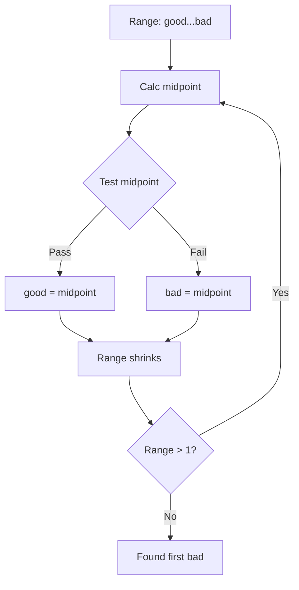

export const metadata = {
  title: "Git Bisect Deep Dive",
  slug: "git-bisect-deep",
  locale: "en",
  section: "concepts",
  summary: "Master Git bisect's binary search, automation with run mode, visualization, and large repo optimization.",
  sourceUrls: [
    "https://git-scm.com/docs/git-bisect",
  ],
};

# Git Bisect Deep Dive

## Overview

`git bisect` uses **binary search** to find the commit that introduced a bug. It turns O(n) linear search into O(log n) — the core tool for regression hunting.

## Basic Workflow

```bash
# 1. Start bisect
git bisect start

# 2. Mark bad commit (current usually broken)
git bisect bad

# 3. Mark good commit (known working)
git bisect good v1.0.0

# 4. Git checks out midpoint, test and mark
git bisect good  # or git bisect bad

# 5. Repeat until found
# Output: first bad commit

# 6. Clean up
git bisect reset
```

## Internal Mechanics

### Binary Search Algorithm



Git maintains a commit set, excluding half each step. Max steps: `log2(N)`.

### Skipping Commits

```bash
# Current commit untestable (e.g., won't build)
git bisect skip

# Skip a range
git bisect skip v1.1..v1.2
```

## Automation (`git bisect run`)

### Basic Usage

```bash
# Write test script (0=good, 1-127=bad, 125=skip)
cat > test.sh << 'EOF'
#!/bin/bash
make test
exit $?
EOF
chmod +x test.sh

# Fully automatic
git bisect run ./test.sh
```

### Script Contract

| Exit Code | Meaning |
|-----------|---------|
| 0 | Test passed (good) |
| 1-127 | Test failed (bad) |
| 125 | Untestable (skip) |
| 128+ | Script error, abort |

### Complex Example

```bash
#!/bin/bash
# test-bisect.sh
set -e

# Build
if ! make -j$(nproc) 2>/dev/null; then
  exit 125  # Build fail, skip
fi

# Run specific test
if ./run-test-suite --filter=regression_login; then
  exit 0
else
  exit 1
fi
```

```bash
git bisect run ./test-bisect.sh
```

## Visualization & Analysis

### View Progress

```bash
# Show current state
git bisect log

# Visualize remaining candidates
git bisect visualize
# Opens gitk with remaining candidates
```

### Manual Inspection

```bash
# See current commit under test
git log --oneline -1

# Count remaining candidates
git bisect log | grep -c "bisect"
```

### Result Analysis

```bash
# On completion shows:
# 1a2b3c4 (first bad commit)
# Author: ...
# Date: ...
#     Commit message

# Save log for postmortem
git bisect log > bisect-log.txt
```

## Large Repo Optimization

### Limit Search Scope

```bash
# Search only specific path
git bisect start -- path/to/subsystem

# Exclude paths
git bisect start -- . ':!vendor/' ':!third_party/'
```

### Pre-skip Irrelevant Commits

```bash
# Skip chore commits
git bisect skip $(git log --oneline --grep="^chore:" --format=%H)

# Skip bot commits
git bisect skip $(git log --oneline --author="bot" --format=%H)
```

### Parallel Testing (Experimental)

```bash
# Use worktrees to test multiple candidates in parallel
git worktree add ../test-1 $(git rev-parse HEAD~10)
git worktree add ../test-2 $(git rev-parse HEAD~20)
# Run tests in parallel across worktrees
```

## Advanced Techniques

### Multiple Good/Bad Marks

```bash
# Mark multiple good
git bisect good v1.0 v1.1 v1.2

# Mark multiple bad
git bisect bad HEAD HEAD~1 HEAD~2
```

### Semantic Terms

```bash
# Custom terminology
git bisect start --term-new=broken --term-old=working
git bisect broken
git bisect working v1.0
```

### Replay Bisect Log

```bash
# Record
git bisect log > bisect.log

# Replay later (reproduce process)
git bisect replay bisect.log
```

## Common Scenarios

### Scenario 1: Performance Regression

```bash
git bisect run ./bench.sh
# bench.sh: runs benchmark, compares threshold
```

### Scenario 2: API Breakage

```bash
git bisect run ./api-compat-check.sh
# Checks public API signatures
```

### Scenario 3: Build Failure

```bash
git bisect run ./build.sh
# Build fail returns 125
```

## Best Practices

1. **Write reusable test scripts** — commit to repo, CI can use them too
2. **Use `skip` for untestable commits** — avoids polluting results
3. **Limit search paths** — 10x+ speedup in large monorepos
4. **Save `bisect log`** — postmortem, audit, team sharing
5. **Automate in CI** — nightly bisect to catch regressions early

## Continue Learning

1. `commands/git-bisect` — git bisect reference
2. `workflows/bisect-regression-triage-workflow` — Regression triage workflow
3. `internals/commit-graph` — Commit graph accelerates bisect
4. `concepts/git-rebase-deep` — Git Rebase Deep Dive
