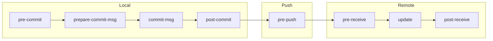

export const metadata = {
  title: "Git Hooks Deep Dive",
  slug: "git-hooks-deep",
  locale: "en",
  section: "concepts",
  summary: "Understand Git Hooks types, lifecycle, sharing mechanisms, and CI/CD integration practices.",
  sourceUrls: [
    "https://git-scm.com/docs/githooks",
    "https://git-scm.com/book/en/v2/Customizing-Git-Git-Hooks",
  ],
};

# Git Hooks Deep Dive

## What you will learn

- Understand the core purpose of Git Hooks Deep Dive
- Master the basic usage and common options of Git Hooks Deep Dive
- Understand Git Hooks types, lifecycle, sharing mechanisms, and CI/CD integration practices.
- Understand key concepts: Overview
- Know when to use this feature and when to avoid it


## Start with a problem

You've encountered a conceptual question while using Git — you roughly know what it means, but you're not entirely sure about its precise definition and boundaries.

## Overview

Git Hooks are custom scripts triggered at key points during Git operations. They're not built-in Git features but leverage Git's event notification mechanism to run external programs.

## Hook Lifecycle



## Core Hooks

### Client-Side Hooks

| Hook | Trigger | Return Value Effect |
|------|---------|-------------------|
| `pre-commit` | Before `git commit` | Non-zero aborts commit |
| `prepare-commit-msg` | Before editor opens | Can modify default message |
| `commit-msg` | After message is saved | Non-zero aborts commit |
| `post-commit` | After commit completes | Return ignored |
| `pre-push` | Before `git push` | Non-zero aborts push |
| `pre-rebase` | Before `git rebase` | Non-zero aborts rebase |
| `post-checkout` | After `git checkout` | Return ignored |
| `post-merge` | After `git merge` | Return ignored |

### Server-Side Hooks

| Hook | Trigger | Description |
|------|---------|-------------|
| `pre-receive` | Before receiving ref updates | Can reject pushes |
| `update` | Before each ref update | Per-branch control |
| `post-receive` | After ref updates complete | Trigger CI, notifications |

## Practical Hook Examples

### pre-commit: Code Quality

```bash
#!/bin/bash
# .git/hooks/pre-commit
echo "Running linter..."
npm run lint
if [ $? -ne 0 ]; then
  echo "Lint failed. Commit aborted."
  exit 1
fi
```

### commit-msg: Message Convention

```bash
#!/bin/bash
# .git/hooks/commit-msg
PATTERN="^(feat|fix|docs|style|refactor|test|chore|ci)(\(.+\))?: .{1,72}"
msg=$(cat "$1")
if ! [[ "$msg" =~ $PATTERN ]]; then
  echo "Error: commit message must match Conventional Commits format"
  echo "  e.g. feat(api): add login endpoint"
  exit 1
fi
```

### pre-push: Protected Branch Check

```bash
#!/bin/bash
# .git/hooks/pre-push
protected_branches="main master develop"
while read local_ref local_sha remote_ref remote_sha; do
  for branch in $protected_branches; do
    if [[ "$remote_ref" == "refs/heads/$branch" ]]; then
      echo "Error: pushing to $branch is not allowed via hook"
      exit 1
    fi
  done
done
exit 0
```

## Sharing Hooks

### Method 1: In-Repository (Recommended)

```bash
# Project structure
my-repo/
├── .githooks/
│   ├── pre-commit
│   └── commit-msg
└── .gitignore

# Configure custom hooks directory
git config core.hooksPath .githooks
```

### Method 2: Global Hooks

```bash
# Create global hooks directory
mkdir -p ~/.git-hooks
git config --global core.hooksPath ~/.git-hooks
```

### Method 3: husky (Node.js Projects)

```bash
npx husky init

# .husky/pre-commit
npx lint-staged
```

## CI Integration

```yaml
# GitHub Actions
jobs:
  lint:
    runs-on: ubuntu-latest
    steps:
      - uses: actions/checkout@v4
      - run: npm ci
      - name: Check commit messages
        run: |
          git log --format=%s -1 | grep -E '^(feat|fix|docs)'
```

## Security Notes

1. **Server-side hooks first**: Client hooks can be bypassed (`git commit --no-verify`)
2. **Don't rely on client hooks for security**: Server-side `pre-receive` is the real defense
3. **Hook script permissions**: Ensure hooks have execute permission (`chmod +x`)
4. **Performance impact**: Complex hooks can significantly slow Git operations

## Try it yourself

1. Practice the git-hooks-deep command in a test repository and observe state changes before and after
2. Experiment with different options and compare the output differences
3. Simulate a real scenario where you would need to use this, and walk through the full process

## Continue Learning

1. `concepts/git-hooks` — Git Hooks basics
2. `workflows/pre-commit-hook-workflow` — Pre-commit hook workflow
3. `concepts/git-lfs-deep` — Git LFS deep dive
