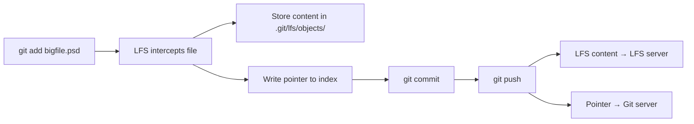

export const metadata = {
  title: "Git LFS Deep Dive",
  slug: "git-lfs-deep",
  locale: "en",
  section: "concepts",
  summary: "Understand Git LFS architecture, performance tuning, server configuration, and large-scale migration strategies.",
  sourceUrls: [
    "https://git-lfs.com/",
    "https://github.com/git-lfs/git-lfs/blob/main/docs/spec.md",
  ],
};

# Git LFS Deep Dive

## What you will learn

- Understand the core purpose of Git LFS Deep Dive
- Master the basic usage and common options of Git LFS Deep Dive
- Understand Git LFS architecture, performance tuning, server configuration, and large-scale migration strategies.
- Understand key concepts: Architecture
- Know when to use this feature and when to avoid it


## Start with a problem

You've encountered a conceptual question while using Git — you roughly know what it means, but you're not entirely sure about its precise definition and boundaries.

## Architecture

Git LFS (Large File Storage) replaces large files with **pointer files**, storing the actual content in a separate object store. Pointer files are only a few dozen bytes, while large files are downloaded on demand.

### Pointer File Structure

```text
version https://git-lfs.github.com/spec/v1
oid sha256:4a7c7f... (64-character hex hash)
size 471859200
```

Only LFS clients can recognize and resolve pointer files. Clients without LFS installed see only the pointer text.

### Workflow



## Server Configuration

### GitHub

```bash
# Up to 2GB LFS storage per repo (free tier)
# Supports S3-compatible object storage
```

### GitLab

```yaml
# /etc/gitlab/gitlab.rb
gitlab_rails['lfs_enabled'] = true
gitlab_rails['lfs_storage_path'] = "/var/opt/gitlab/lfs-objects"

# Use object storage
gitlab_rails['object_store']['enabled'] = true
gitlab_rails['object_store']['remote_directory'] = 'gitlab-lfs'
gitlab_rails['object_store']['connection'] = {
  'provider' => 'AWS',
  'region' => 'us-east-1',
  'aws_access_key_id' => 'AWS_ACCESS_KEY',
  'aws_secret_access_key' => 'AWS_SECRET_ACCESS_KEY'
}
```

### Gitea

```INI
[server]
LFS_START_SERVER = true
LFS_JWT_SECRET = your-secret-key
LFS_CONTENT_PATH = /data/git/lfs
```

## Performance Tuning

### On-Demand Download (Smudge Strategy)

```bash
# Default: download LFS files on checkout
git config --global lfs.fetchinclude "*.psd,*.bin"
git config --global lfs.fetchexclude "*.zip,*.tar.gz"

# Skip smudge: don't download on checkout
GIT_LFS_SKIP_SMUDGE=1 git clone https://github.com/user/repo.git
cd repo
git lfs pull --include="*.psd"
```

### Caching and Parallelism

```bash
# Enable parallel uploads/downloads
git config --global lfs.concurrenttransfers 8

# Set transfer cache
git config --global lfs.cache-url https://lfs-cache.example.com
```

### Cleanup

```bash
# View LFS usage
git lfs ls-files --size
git lfs ls-files --all

# Prune old LFS objects
git lfs prune
git lfs prune --dry-run  # Preview
```

## Migration Strategy

### Migrate Existing Large Files to LFS

```bash
# Migrate specific file types
git lfs migrate import --include="*.psd,*.bin" --everything

# Migrate files above a size threshold
git lfs migrate import --above=10MB --everything
```

### Post-Migration Checks

```bash
# Verify migration
git lfs fsck --pointers
git lfs ls-files --all | wc -l

# Clean up original large file refs
git reflog expire --expire-unreachable=now --all
git gc --prune=now
```

### Batch Migration Script

```bash
#!/bin/bash
for repo in repo-a repo-b repo-c; do
  cd $repo
  git lfs migrate import --include="*.psd,*.bin" --everything
  git push --force origin main
  cd ..
done
```

## Best Practices

1. **Introduce LFS early**: Smaller repos have lower migration cost
2. **Precise file matching**: Use `--include` to target specific file types
3. **Regular pruning**: Run `git lfs prune` to remove local unneeded objects
4. **CI optimization**: Use `GIT_LFS_SKIP_SMUDGE=1` in CI to avoid unnecessary downloads
5. **Backup LFS storage**: LFS object store needs its own backup strategy

## Try it yourself

1. Practice the git-lfs-deep command in a test repository and observe state changes before and after
2. Experiment with different options and compare the output differences
3. Simulate a real scenario where you would need to use this, and walk through the full process

## Continue Learning

1. `concepts/git-lfs` — Git LFS basics
2. `concepts/git-hooks-deep` — Git Hooks deep dive
3. `performance/large-repo-optimization` — Large repo optimization
