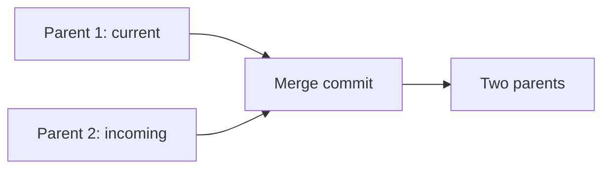

export const metadata = {
  title: "Git Merge Deep Dive",
  slug: "git-merge-deep",
  locale: "en",
  section: "concepts",
  author: "lance-mq",
  summary: "Understand Git merge strategies, recursive merge, ours/theirs, octopus merge, and conflict resolution.",
  sourceUrls: [
    "https://git-scm.com/docs/git-merge",
    "https://git-scm.com/docs/merge-strategies",
  ],
  citations: [
    {
      title: "Git merge",
      url: "https://git-scm.com/docs/git-merge",
      kind: "official",
    },
    {
      title: "Merge strategies",
      url: "https://git-scm.com/docs/merge-strategies",
      kind: "official",
    },
  ],
};

# Git Merge Deep Dive

## What you will learn

- Understand the core purpose of Git Merge Deep Dive
- Master the basic usage and common options of Git Merge Deep Dive
- Understand Git merge strategies, recursive merge, ours/theirs, octopus merge, and conflict resolution.
- Understand key concepts: Overview
- Know when to use this feature and when to avoid it


## Start with a problem

You've encountered a conceptual question while using Git — you roughly know what it means, but you're not entirely sure about its precise definition and boundaries.

## Overview

`git merge` joins two or more development histories. Git supports multiple merge strategies, defaulting to **recursive**.

## Merge Strategies

### 1. Recursive (Default)

```bash
git merge feature
# Same as
git merge -s recursive feature
```

**Characteristics**:
- Three-way merge (common ancestor + two heads)
- Automatic rename detection
- Supports `ours`/`theirs` sub-strategies for conflicts

```bash
# Auto-choose current branch on conflict
git merge -s recursive -X ours feature

# Auto-choose incoming branch on conflict
git merge -s recursive -X theirs feature

# Ignore whitespace changes
git merge -s recursive -X ignore-space-change feature
```

### 2. Ort (Ostensibly Recursive's Twin)

Git 2.32+ modern replacement for recursive:
- Better performance (especially large repos)
- More accurate conflict detection
- Default in Git 2.37+

```bash
git merge -s ort feature
```

### 3. Ours (Ignore Incoming)

```bash
git merge -s ours feature
```
- Result tree = current branch exactly
- Only records merge commit, introduces no changes
- Use case: record already-merged branch, mark deprecated

### 4. Theirs (Take Incoming)

```bash
git merge -s theirs feature
```
- Result tree = incoming branch exactly
- Note: strategy-level, not `-X theirs` (which is conflict resolution option)

### 5. Octopus (Multi-head)

```bash
git merge branch1 branch2 branch3
```
- Merges multiple branches simultaneously (>2 heads)
- Only works when no conflicts
- Common for release integration: `git merge feature-a feature-b feature-c`

### 6. Resolve (Legacy Three-way)

```bash
git merge -s resolve feature
```
- Legacy three-way algorithm
- Weak rename/complex history handling
- Only for compatibility with very old Git

## Conflict Resolution

### Conflict Markers

```text
<<<<<<< HEAD
Current branch content
=======
Incoming branch content
>>>>>>> feature
```

### Tools

```bash
# Launch merge tool
git mergetool

# Common: vimdiff, kdiff3, meld, vscode
git config --global merge.tool vscode
```

### Resolution Options

| Option | Effect |
|--------|--------|
| `-X ours` | Choose current branch on conflict |
| `-X theirs` | Choose incoming branch on conflict |
| `-X ignore-space-change` | Ignore whitespace conflicts |
| `-X ignore-all-space` | Ignore all whitespace |
| `-X rename-threshold=N` | Rename detection threshold (default 50%) |

## Merge Commit Structure

```bash
# Regular merge (no fast-forward)
git merge --no-ff feature

# Fast-forward (default if possible)
git merge feature

# Force merge commit
git merge --no-ff feature
```

### Merge Commit Specialty



Two parents enable:
- `git log --first-parent` — mainline only
- `git log --all` — full topology

## Advanced Usage

### Merge Specific Files

```bash
# Merge single file from another branch
git checkout feature -- path/to/file
# Or
git restore -s feature -- path/to/file

# Subtree merge (preserve history)
git merge -s subtree feature
```

### Squash Merge

```bash
# Squash all commits into one
git merge --squash feature
git commit
```
- No merge commit (single parent)
- Loses branch topology
- GitHub/GitLab PR "Squash and merge" uses this

### Preview Before Commit

```bash
# Preview result without committing
git merge --no-commit --no-ff feature
git diff HEAD
git merge --abort  # Cancel
```

## Best Practices

1. **Feature branches: `--no-ff`** — preserves topology for traceability
2. **Release branches: Octopus** — integrate multiple features at once
3. **Automate conflicts with `-X`** — reduce manual intervention in CI
4. **Merge upstream regularly** — reduces large conflict probability
5. **Protect main branch** — require PR + review, no direct push

## Common Issues

| Issue | Cause | Fix |
|-------|-------|-----|
| "Already up to date" | Incoming is ancestor | Nothing to merge |
| "Not possible to fast-forward" | Diverged history | Use `--no-ff` or rebase first |
| Many conflicts | Long divergence | Merge upstream regularly, or rebase sync |
| Too many merge commits | Frequent mainline merges | Use rebase instead of merge for sync |

## Try it yourself

1. Practice the git-merge-deep command in a test repository and observe state changes before and after
2. Experiment with different options and compare the output differences
3. Simulate a real scenario where you would need to use this, and walk through the full process

## Continue Learning

1. `commands/git-merge` — git merge reference
2. `internals/three-way-merge-mechanics` — Three-way merge internals
3. `concepts/merge-strategies` — Strategy comparison
4. `concepts/git-rebase-deep` — Git Rebase Deep Dive

{/* internal-links:auto */}

## Further reading

Keep going on the same topic:

- [Managing Large Files with Git LFS](/en/concepts/git-lfs)
- [Git Rebase Deep Dive](/en/concepts/git-rebase-deep)
- [Git Rerere Deep Dive](/en/concepts/git-rerere-deep)

