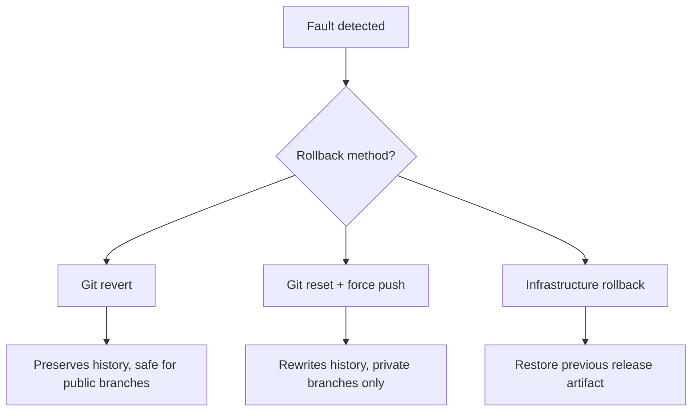

export const metadata = {
  title: "CI/CD Deployment Strategies with Git",
  slug: "ci-cd-deployment-strategies",
  locale: "en",
  section: "devops",
  author: "lance-mq",
  summary: "A comprehensive guide to Git-based deployment strategies including tag-based deployments, environment promotion (dev→staging→prod), canary releases, GitOps deployment patterns, and rollback strategies using Git revert.",
  sourceUrls: [
    "https://trunkbaseddevelopment.com/",
    "https://www.gitops.tech/",
  ],
  citations: [
    {
      title: "Trunkbaseddevelopment.com",
      url: "https://trunkbaseddevelopment.com/",
      kind: "blog",
    },
    {
      title: "Www.gitops.tech",
      url: "https://www.gitops.tech/",
      kind: "blog",
    },
  ],
};

# CI/CD Deployment Strategies with Git

## What you will learn

- Understand "Git as the deployment control layer": how tags, branches, and commit history define a reversible release path
- Trigger tag-based deploys, infer versions with `git describe`, and build a dev→staging→prod promotion pipeline
- Compare two patterns that hand "deployment state" to Git: canary releases and GitOps (ArgoCD / Flux)
- Know whether to use `git revert` or `git reset --force` on failure, and how to roll back safely


## Start with a problem

You shipped a release, and five minutes later production is throwing errors. What you need now is not "fix it again" but "get back to the last good state, fast and deterministically" — and to be able to say exactly what you rolled back to. If your release isn't tied to Git — no tag, no traceable commit — you're rolling back from memory and manual steps, which is risky. This article makes every release a precise, recoverable point in Git history.

## One-Sentence Understanding

Use Git as the central control layer for deployments — leveraging tags, branches, and commit history to define environment promotion paths, enabling traceable and reversible automated releases.

## Git Tag-Based Deployments

### Semantic Version Tags

```yaml
# GitHub Actions - tag-triggered deployment
on:
  push:
    tags:
      - "v*"

jobs:
  deploy:
    steps:
      - uses: actions/checkout@v4
        with:
          fetch-tags: true
      - run: |
          VERSION=${GITHUB_REF_NAME#v}
          echo "Deploying version $VERSION to production"
          ./deploy.sh "$VERSION"
```

### Version Inference with `git describe`

```yaml
- run: |
    git fetch --tags origin
    VERSION=$(git describe --tags --abbrev=0 --match "v*" 2>/dev/null || echo "v0.0.0")
    BUILD_META=$(git rev-parse --short HEAD)
    echo "FULL_VERSION=${VERSION}+${BUILD_META}" >> $GITHUB_ENV
```

## Environment Promotion

### Three-Stage Promotion Model

```
Feature Branch → Develop (Dev Env) → Main (Staging Env) → Tag (Production Env)
```

### Environment Promotion Pipeline

```yaml
# GitLab CI - environment promotion
stages:
  - build
  - deploy-dev
  - deploy-staging
  - deploy-prod

build:
  stage: build
  script: npm run build
  artifacts:
    paths:
      - dist/

deploy-dev:
  stage: deploy-dev
  script: deploy-to-dev
  environment:
    name: development
    url: https://dev.example.com
  rules:
    - if: $CI_COMMIT_BRANCH == "develop"

deploy-staging:
  stage: deploy-staging
  script: deploy-to-staging
  environment:
    name: staging
    url: https://staging.example.com
  rules:
    - if: $CI_COMMIT_BRANCH == "main"

deploy-prod:
  stage: deploy-prod
  script: deploy-to-prod
  environment:
    name: production
    url: https://example.com
  rules:
    - if: $CI_COMMIT_TAG
      when: manual  # requires manual approval
```

### Environment Promotion Checklist

| Environment | Trigger | Method | Validation |
|-------------|---------|--------|------------|
| Dev | Push develop | Auto | Unit tests pass |
| Staging | PR merge to main | Auto | Integration tests pass |
| Prod | Tag push | Manual approval | All tests + sign-off |

## Canary Deployments with Git

### Git Branch-Based Canary Strategy

```yaml
jobs:
  canary:
    steps:
      - checkout
      - run: |
          if [ "$CIRCLE_BRANCH" = "canary" ]; then
            ./deploy-canary.sh  # deploy to 10% of instances
            sleep 300           # observe for 5 minutes
            ./promote-canary.sh # full rollout if stable
          fi
```

### Progressive Traffic Shift

```yaml
- run: |
    COMMIT_HASH=$(git rev-parse --short HEAD)
    CANARY_PERCENT=$(( 0x${COMMIT_HASH:0:2} % 100 ))
    echo "Canary traffic: ${CANARY_PERCENT}%"
    ./deploy-weighted.sh "${CANARY_PERCENT}"
```

## GitOps Deployment Patterns

### GitOps Core Principles

```
Git Repository (Single Source of Truth)
       ↓
  CI Pipeline (Build & Test)
       ↓
GitOps Operator (e.g. ArgoCD / Flux)
       ↓
  Target Environment
```

### ArgoCD Example

```yaml
# argo-application.yaml
apiVersion: argoproj.io/v1alpha1
kind: Application
metadata:
  name: my-app
spec:
  source:
    repoURL: https://github.com/org/manifests.git
    targetRevision: main
    path: overlays/production
  destination:
    server: https://kubernetes.default.svc
    namespace: production
  syncPolicy:
    automated:
      prune: true
      selfHeal: true
```

### Flux CD Example

```yaml
apiVersion: kustomize.toolkit.fluxcd.io/v1
kind: Kustomization
metadata:
  name: apps
spec:
  interval: 5m
  sourceRef:
    kind: GitRepository
    name: flux-system
  path: ./apps/production
  prune: true
```

## Rollback Strategies

### Git Revert Rollback

```yaml
# Automated rollback in CI
jobs:
  rollback:
    steps:
      - uses: actions/checkout@v4
        with:
          fetch-depth: 0
      - run: |
          LAST_STABLE=$(git tag --sort=-version:refname | head -2 | tail -1)
          echo "Rolling back to: $LAST_STABLE"
          git revert --no-commit HEAD
          git commit -m "Revert to $LAST_STABLE [rollback]"
          git push
          git tag -f "rollback-$(date +%Y%m%d%H%M)" HEAD
          git push --tags -f
```

### Progressive Rollback

```yaml
- run: |
    for p in 100 75 50 25 0; do
      echo "Shifting traffic to ${p}% stable version"
      ./shift-traffic.sh "$p"
      sleep 60
    done
```

### Rollback Decision Tree



<WarningBox title="Never use git reset + force push to roll back on shared branches">
  The "reset + force push" branch of the decision tree is for branches you fully own. On shared branches like `main` it rewrites public history, making collaborators' commits disappear and causing chaos. For public branches, prefer `git revert` — it adds a new inverse commit without destroying anyone's history.
</WarningBox>

## Try it yourself

1. In a test repo, tag `v0.1.0` and push it, then write a GitHub Actions workflow that triggers deployment only on `tags: v*` and computes a full version with `git describe`.
2. Build a three-stage GitLab CI promotion pipeline (dev / staging / prod) where the prod stage is `when: manual`, and feel the "release needs human approval" gate for yourself.
3. Deliberately push a "bad commit" to main, then `git revert` it into a new commit and push; compare that with `git reset --hard` + force push for safety on a shared branch.

## Continue Learning

1. `ci-cd/ci-cd-testing-strategies` — CI/CD testing strategies with Git
2. `ci-cd/circleci-git` — CircleCI with Git integration
3. `ci-cd/ci-security-basics` — Git security in CI/CD

{/* internal-links:auto */}

## Further reading

Keep going on the same topic:

- [CI/CD Testing Strategies with Git](/en/devops/ci-cd-testing-strategies)
- [Git Security Basics in CI/CD](/en/devops/ci-security-basics)

