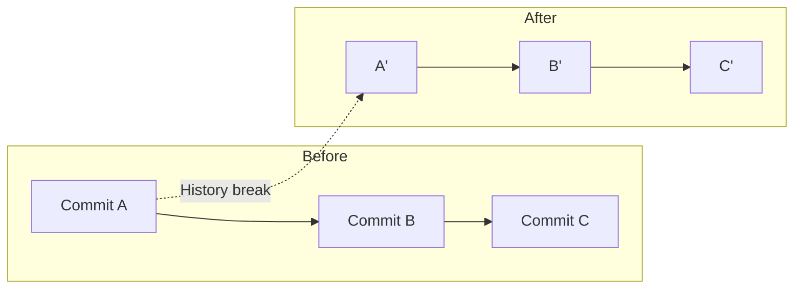

export const metadata = {
  title: "git filter-repo Repository Rewriting Deep Dive",
  slug: "git-filter-repo",
  locale: "en",
  section: "migration",
  author: "lance-mq",
  summary: "An in-depth look at git filter-repo, covering repository splitting, file cleanup, author info rewriting, and advanced usage compared to filter-branch and BFG.",
  sourceUrls: ["https://github.com/newren/git-filter-repo"],
  citations: [
    {
      title: "Git filter repo",
      url: "https://github.com/newren/git-filter-repo",
      kind: "discussion",
    },
  ],
};

## Start with a problem

Your team is migrating from another version control system to Git, or moving code and history between different Git platforms. You're worried about losing commit history or author information during the process.

## One-Sentence Understanding

git filter-repo is the officially recommended history rewriting tool — tens of times faster than filter-branch, more flexible than BFG, and the go-to choice for repository cleanup and splitting.

## What is git filter-repo

Developed by Elijah Newren, git filter-repo is now Git's recommended tool for history rewriting. It works by directly reading and rewriting Git's object database, avoiding the per-command shell overhead of filter-branch.

```bash
# Install

## What you will learn

- Understand the core purpose of Install
- Master the basic usage and common options of Install
- An in-depth look at git filter-repo, covering repository splitting, file cleanup, author info rewriting, and advanced usage compared to filter-branch and BFG.
- Understand key concepts: What is git filter-repo
- Know when to use this feature and when to avoid it

brew install git-filter-repo
# or pip
pip install git-filter-repo
```

Core design principles: fast (leveraging Python's batch processing), safe (no bare repo operations by default), flexible (custom logic via Python callbacks).

## Core Use Cases

### Repository Splitting

Extract a subdirectory into a standalone repository:

```bash
# Extract subdir/ as a new repo, preserving its full history
git filter-repo --path subdir/ --subdirectory-filter .
```

### File Cleanup

Permanently remove sensitive or large files:

```bash
# Remove all history of specified files
git filter-repo --path passwords.txt --path secrets/ --invert-paths

# Strip all blobs larger than 10MB
git filter-repo --strip-blobs-bigger-than 10M
```

### Rewriting Author Info

Normalize author names and emails across the repository:

```bash
# Create a mailmap file
cat > mailmap.txt << EOF
old@corp.com New Name <new@corp.com>
another@corp.com Another Name <another@corp.com>
EOF

git filter-repo --mailmap mailmap.txt
```

### Path-Based Filtering

Keep only specific paths, discard everything else:

```bash
# Preserve only src/ and README.md history
git filter-repo --path src/ --path README.md
```

## Comparison with filter-branch and BFG

| Feature | git filter-repo | git filter-branch | BFG Repo-Cleaner |
|---------|----------------|-------------------|------------------|
| Performance | Blazing fast (minutes for 10K commits) | Slow (per-commit fork overhead) | Fast (large-file focused) |
| Flexibility | Extreme (Python callbacks) | Medium (shell expressions) | Low (preset operations) |
| Safety | Default refs/backup backup | Partial support | No built-in backup |
| Multi-path | Native support | Requires scripting | Not supported |
| Author rewrite | Built-in mailmap | Requires custom code | Supported |
| Maintenance | Actively maintained | Deprecated | Archived |

### Performance Benchmark

Real-world test (100K commits, 500MB repo, deleting a single large file):

- git filter-branch: ~45 minutes
- BFG: ~3 minutes
- git filter-repo: ~45 seconds

## Advanced Patterns: Python Callbacks

The true power of git filter-repo lies in its callback mechanism, giving you full control over history rewriting with Python:

```python
# callback.py: custom commit filtering logic
def commit_callback(commit, metadata):
    # Only keep commits that don't contain "WIP"
    if b"WIP" in commit.message:
        return False  # skip WIP commits
    commit.message += b"\nProcessed by git-filter-repo"
    return True

def blob_callback(blob, metadata):
    # Replace sensitive URLs in all blobs
    old_url = b"http://old-server.com"
    new_url = b"https://new-server.com"
    if old_url in blob.data:
        blob.data = blob.data.replace(old_url, new_url)
```

```bash
# Use callbacks
git filter-repo --refs HEAD --force --callback callback.py
```

Advanced callback uses: filter by file content (delete blobs matching patterns), code style conversion, license header replacement, and more.

## Safety Considerations with Shared History

Rewriting history changes every subsequent commit's SHA-1, breaking compatibility with existing clones. Safety rules:

1. **Communicate first**: Notify all collaborators, agree on a time window
2. **Freeze upstream**: Block pushes during rewriting
3. **Force push safely**: Use `git push --force-with-lease` (safer than `--force`)
4. **Tag backup**: Create a backup ref before rewriting

```bash
# Safe backup before rewriting
git tag pre-rewrite-backup
git push origin pre-rewrite-backup

# Rewrite a pushed repository
git filter-repo --path src/ --refs HEAD --force
git remote add origin <new-url>
git push --force-with-lease origin main
```

5. **Coordinate team**: All collaborators must re-clone or rebase after rewrite

```bash
# Collaborator recovery
git fetch --all
git rebase --onto origin/main origin/main-pre-rewrite main
```

## Visualizing Rewrite Impact



Every commit hash changes — this is why force-push and team coordination are mandatory.

## Try it yourself

1. Practice the git-filter-repo command in a test repository and observe state changes before and after
2. Experiment with different options and compare the output differences
3. Simulate a real scenario where you would need to use this, and walk through the full process

## Continue Learning

- See [Migration Strategy Guide](./migration-strategy-guide) for incorporating filter-repo into migration cleanup
- Read the official docs: [git filter-repo GitHub](https://github.com/newren/git-filter-repo)
- Advanced reading: Git Book [Rewriting History](https://git-scm.com/book/en/v2/Git-Tools-Rewriting-History)

{/* internal-links:auto */}

## Further reading

Keep going on the same topic:

- [Azure DevOps (TFS) to Git Migration](/en/migration/azure-devops-migration)
- [Perforce to Git Migration](/en/migration/git-p4-perforce)
- [Mercurial to Git Migration Guide](/en/migration/hg-to-git)

