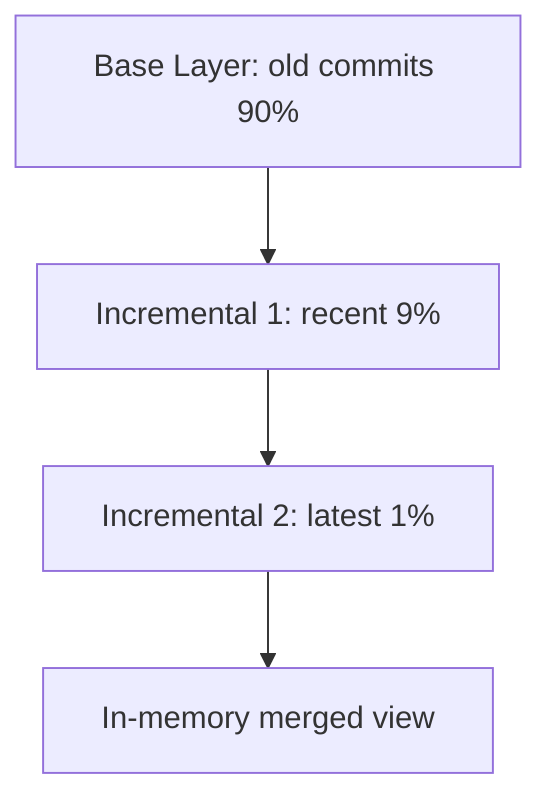

export const metadata = {
  title: "Commit Graph Deep Dive",
  slug: "commit-graph-deep",
  locale: "en",
  section: "performance",
  summary: "Understand Git Commit Graph's layered structure, Generation Numbers, Bloom Filters, and large repo acceleration.",
  sourceUrls: [
    "https://git-scm.com/docs/git-commit-graph",
    "https://github.com/git/git/blob/master/Documentation/technical/commit-graph.txt",
  ],
  citations: [
    {
      title: "Git commit graph",
      url: "https://git-scm.com/docs/git-commit-graph",
      kind: "official",
    },
    {
      title: "Commit graph.txt",
      url: "https://github.com/git/git/blob/master/Documentation/technical/commit-graph.txt",
      kind: "discussion",
    },
  ],
};

# Commit Graph Deep Dive

## What you will learn

- Understand the core purpose of Commit Graph Deep Dive
- Master the basic usage and common options of Commit Graph Deep Dive
- Understand Git Commit Graph's layered structure, Generation Numbers, Bloom Filters, and large repo acceleration.
- Understand key concepts: Overview
- Know when to use this feature and when to avoid it


## Start with a problem

Your Git repository keeps growing, clones are getting slower, and everyday operations are starting to feel sluggish. You want to know what optimization techniques are available and which ones fit your project.

## Overview

The **Commit Graph** is Git's acceleration index — serializing commit topology to binary files, turning `git log`, `git merge-base`, `git bisect` etc. from O(N) to O(log N) or O(1).

## Why Commit Graph?

### Traditional Traversal Problem

```bash
# Without commit-graph
git log --oneline -100
# Git must:
# 1. Read each commit object
# 2. Parse parent links
# 3. Build in-memory topology
# Complexity: O(N) reads + O(N) parse
```

Large repos (Linux kernel 1M+ commits) cold `git log` takes seconds.

### Commit Graph Solution

- **Pre-computes** topology (parents, generation numbers, commit dates)
- **Binary format** single mmap read
- **Incremental updates** only process new commits

## File Structure

### Storage Location

```
.git/objects/info/commit-graph           # Single file mode
.git/objects/info/commit-graphs/         # Layered mode (Git 2.23+)
├── commit-graph-chain                  # Chain file list
├── commit-graph-<hash>.graph           # Base layer
├── commit-graph-<hash>.graph           # Incremental layer 1
└── ...
```

### Layered Mode



- **Base layer**: Historical commits, read-only, rarely changes
- **Incremental layers**: New commits, frequently rewritten
- Auto-merge: when incremental layers exceed threshold, rewrite base

## Core Data Structures

### 1. Generation Number

```text
Definition: Max distance to root commit
- Root commit: generation = 1
- Single parent: generation = parent.generation + 1
- Merge commit: generation = max(parents.generation) + 1
```

**Purpose**: Fast ancestor checks
- `A.generation > B.generation` → A cannot be B's ancestor
- Avoids full topology traversal

### 2. Commit Date

Used for topological sorting, `git log --date-order`.

### 3. Parent Pointers

Stored as commit-graph array indices (not object IDs), saving space and speeding traversal.

### 4. Bloom Filter (Git 2.32+)

```text
Purpose: Accelerate path filtering (git log -- <path>)
Mechanism: Each commit stores Bloom filter of modified paths
Query: Check if path "possibly" modified in commit
- False positives possible, false negatives impossible
```

Config:
```bash
git config --global core.commitGraphGenerationVersion 2
git commit-graph write --reachable --bloom-filter=256
```

## Generation & Maintenance

### Manual Generation

```bash
# Full (all reachable)
git commit-graph write --reachable

# Incremental (new commits only)
git commit-graph write --changed-paths --bloom-filter=256

# Layered write
git commit-graph write --split=replace
```

### Automatic Maintenance

```bash
# Enable auto-write (with git maintenance)
git config --global core.commitGraph true
git config --global maintenance.commit-graph.enabled true
git maintenance start
```

### Verification

```bash
# Read & verify
git commit-graph verify

# Show stats
git commit-graph read --object-dir=.git/objects
```

## Performance Impact

| Operation | No Commit Graph | With Commit Graph | Speedup |
|-----------|----------------|-------------------|---------|
| `git log --oneline -100` | ~2-5s | ~50ms | 40-100x |
| `git merge-base A B` | O(N) | O(log N) | 10-50x |
| `git bisect` | O(N log N) | O(log² N) | 5-20x |
| `git log -- <path>` | Full scan | Bloom Filter | 10-100x |

## Advanced Config

### Generation Version

```bash
# v1: Classic generation number
# v2: Corrected generation (more accurate, Git 2.30+ default)
git config --global core.commitGraphGenerationVersion 2
```

### Bloom Filter

```bash
# bloom-filter=<bits per entry>
# Recommended 256 (balance size vs precision)
git commit-graph write --bloom-filter=256 --changed-paths
```

### Layered Strategy

```bash
# Merge when incremental layers exceed N
git config --global commitGraph.splitMergeThreshold 8

# Max layers
git config --global commitGraph.maxNewLayers 64
```

## Troubleshooting

### Corruption Recovery

```bash
# Remove corrupted commit-graph
rm -rf .git/objects/info/commit-graph*

# Regenerate
git commit-graph write --reachable
```

### Compatibility

- Git < 2.18: Not supported
- Git 2.18-2.22: Single file mode
- Git 2.23+: Layered mode (recommended)
- Git 2.30+: Generation v2
- Git 2.32+: Bloom Filter

## Best Practices

1. **Enable on all large repos** — `git config core.commitGraph true`
2. **Pair with `git maintenance` for auto-upkeep** — zero-touch updates
3. **Enable Bloom Filter** — massive `git log -- <path>` speedup
4. **Use Generation v2** — more accurate ancestor checks
5. **Pre-generate in CI** — `git commit-graph write --reachable` speeds later jobs

## Try it yourself

1. Practice the commit-graph-deep command in a test repository and observe state changes before and after
2. Experiment with different options and compare the output differences
3. Simulate a real scenario where you would need to use this, and walk through the full process

## Continue Learning

1. `internals/commit-graph` — Commit Graph internals
2. `performance/git-maintenance` — Auto maintenance framework
3. `concepts/git-bisect-deep` — Bisect leverages Commit Graph
4. `commands/git-commit-graph` — Command reference
