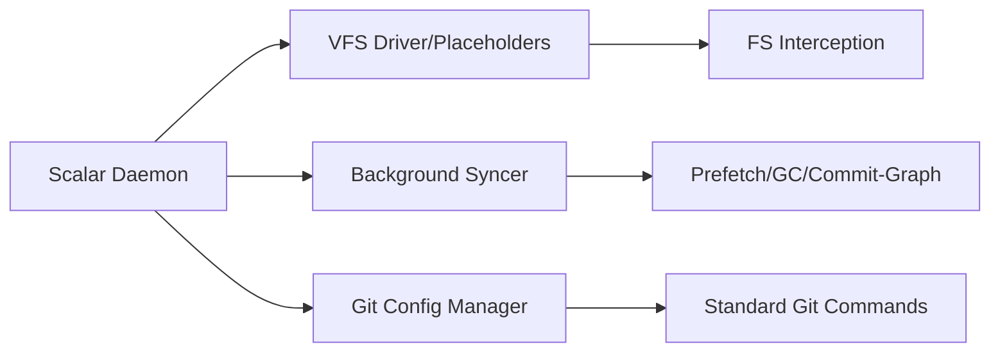
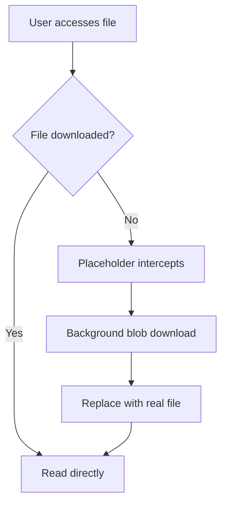

export const metadata = {
  title: "Scalar Git Deep Dive",
  slug: "scalar-git",
  locale: "en",
  section: "performance",
  summary: "Understand Scalar (formerly GVFS): Microsoft's virtual filesystem and background sync for massive repos, enabling on-demand downloads with standard Git compatibility.",
  sourceUrls: [
    "https://github.com/scalar/scalar",
    "https://github.com/microsoft/VFSForGit",
  ],
  citations: [
    {
      title: "github.com — Scalar",
      url: "https://github.com/scalar/scalar",
      kind: "discussion",
    },
    {
      title: "VFSForGit",
      url: "https://github.com/microsoft/VFSForGit",
      kind: "discussion",
    },
  ],
};

# Scalar Git Deep Dive

## What you will learn

- Understand the core purpose of Scalar Git Deep Dive
- Master the basic usage and common options of Scalar Git Deep Dive
- Understand Scalar (formerly GVFS): Microsoft's virtual filesystem and background sync for massive repos, enabling on-demand downloads with standard Git compatibility.
- Understand key concepts: Overview
- Know when to use this feature and when to avoid it


## Start with a problem

Your Git repository keeps growing, clones are getting slower, and everyday operations are starting to feel sluggish. You want to know what optimization techniques are available and which ones fit your project.

## Overview

**Scalar** (formerly GVFS — Git Virtual File System) is Microsoft's toolkit for **massive repositories** (Windows kernel, Office, Azure DevOps — millions of files, hundreds of GBs). It makes Git viable at scale with:
- **Virtual filesystem**: On-demand file downloads (placeholders)
- **Background sync**: Prefetch, GC, commit-graph maintenance
- **Standard Git compatibility**: No toolchain changes needed

## Architecture

### Core Components



### Operating Modes

| Mode | Description | Best For |
|------|-------------|----------|
| **Full Clone** | Download all objects | Small/medium repos, CI |
| **Scalar Clone** | Metadata only + on-demand files | Massive repos, daily dev |
| **Partial Clone** | `--filter=blob:none` | Bandwidth-limited, no full history needed |

## Installation & Setup

### Install

```bash
# Windows (recommended)
winget install Microsoft.Scalar

# macOS
brew install scalar

# Linux
# Download .deb/.rpm or build from source
```

### Register Repo

```bash
# Scalar clone (recommended for large repos)
scalar clone https://github.com/microsoft/Windows.git

# Or register existing repo
cd existing-repo
scalar register
```

### Auto-configuration

```bash
# Scalar auto-configures:
git config core.fsmonitor true           # FS monitor
git config core.untrackedCache true      # Untracked cache
git config feature.manyFiles true        # Many files optimization
git config index.threads true            # Multi-threaded index
git config pack.threads true             # Multi-threaded pack
git config maintenance.auto true         # Auto maintenance
```

## On-Demand Download (Placeholder Mechanism)

### How It Works



- **Placeholder**: Tiny stub file (bytes) marking content not downloaded
- **Trigger**: First read/execute/edit of file
- **Transparent**: Apps see normal files, zero awareness

### Control Downloads

```bash
# Prefetch directory
scalar prefetch --path=src/

# Prefetch specific commit
scalar prefetch --commit=<sha>

# View download status
scalar diagnose
```

## Background Sync & Maintenance

### Auto Maintenance Tasks

```bash
# Scalar daemon periodically:
# 1. Prefetches remote updates
# 2. Runs git maintenance (GC, commit-graph, pack-refs)
# 3. Cleans expired placeholders
# 4. Updates remote tracking branches
```

### Manual Triggers

```bash
# Full sync
scalar fetch

# Prefetch only
scalar prefetch

# Run maintenance
scalar maintain

# Health check
scalar diagnose
```

## Standard Git Compatibility

### Transparent Usage

```bash
# All standard Git commands work
git status
git add .
git commit -m "msg"
git push
git pull
git log
git blame
git diff
```

### Known Limitations

| Operation | Status | Notes |
|-----------|--------|-------|
| `git grep` | Limited | Undownloaded files not searched |
| `git diff` | Normal | Compares downloaded content |
| `git blame` | Normal | Requires file download |
| `git stash` | Normal | |
| Submodules | Partial | Need separate registration |

## Best Practices for Large Repos

### 1. Use Scalar Clone

```bash
# Instead of git clone
scalar clone https://github.com/large/repo.git
```

### 2. Configure Prefetch Strategy

```bash
# Only prefetch recent commits' files
git config scalar.maxPrefetchCommits 100

# Exclude large dirs
git config scalar.excludePaths "vendor/,third_party/,bin/"
```

### 3. CI/CD Integration

```yaml
# GitHub Actions
jobs:
  build:
    runs-on: windows-latest
    steps:
      - uses: actions/checkout@v4
        with:
          repository: microsoft/Windows
      - name: Setup Scalar
        run: |
          scalar register
          scalar prefetch --commit=${{ github.sha }}
      - name: Build
        run: msbuild ...
```

## Troubleshooting

### Common Issues

```bash
# Placeholder stuck
scalar diagnose --verbose

# Sync failed
scalar fetch --verbose

# Daemon not running
scalar service start

# Reset repo state
scalar unregister
scalar register
```

### Log Locations

```bash
# Windows
%LOCALAPPDATA%\Scalar\log\scalar.log

# macOS/Linux
~/.scalar/log/scalar.log
```

## Alternatives Comparison

| Solution | Pros | Cons | Best For |
|----------|------|------|----------|
| **Scalar** | Full compat, on-demand, bg maintenance | Requires install on Win/macOS/Linux | Massive monorepos |
| **Partial Clone** | Native Git, no extra tools | No virtualization, needs network | Medium-large repos |
| **Sparse Checkout** | Native, dir-level filter | Still downloads object metadata | Monorepo partial dev |
| **Submodules** | Native, modular | Complex mgmt, weak atomicity | Multi-repo architectures |

## Try it yourself

1. Practice the scalar-git command in a test repository and observe state changes before and after
2. Experiment with different options and compare the output differences
3. Simulate a real scenario where you would need to use this, and walk through the full process

## Continue Learning

1. `performance/partial-clone` — Partial clone
2. `performance/git-maintenance` — Maintenance framework
3. `internals/transfer-protocols-and-negotiation` — Transfer protocols
4. `performance/large-repo-optimization` — Large repo optimization

{/* internal-links:auto */}

## Further reading

Keep going on the same topic:

- [Large Repository Performance Optimization](/en/performance/large-repo-optimization)
- [Partial Clone: On-Demand Git Object Fetching](/en/performance/partial-clone)
- [Deep Dive into Shallow Clone](/en/performance/shallow-clone-deep)

