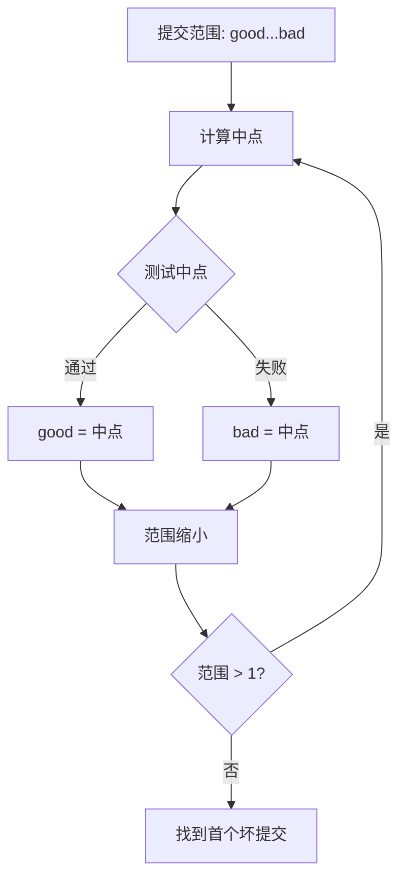

export const metadata = {
  title: "Git Bisect 深入",
  slug: "git-bisect-deep",
  locale: "zh",
  section: "concepts",
  author: "lance-mq",
  summary: "深入掌握 Git Bisect 的二分查找原理、自动化脚本、run 模式、可视化与大型仓库优化。",
  sourceUrls: [
    "https://git-scm.com/docs/git-bisect",
  ],
  citations: [
    {
      title: "Git bisect",
      url: "https://git-scm.com/docs/git-bisect",
      kind: "official",
    },
  ],
};

# Git Bisect 深入

## 学完这篇你会掌握什么

- 理解 Git Bisect 深入 的核心作用和适用场景
- 掌握 Git Bisect 深入 的基本用法和常用参数
- 深入掌握 Git Bisect 的二分查找原理、自动化脚本、run 模式、可视化与大型仓库优化。
- 理解 概述 相关的概念
- 掌握 基本工作流 相关的操作
- 知道在什么场景下使用该命令，什么场景下避免使用


## 先想一个问题

你在使用 Git 的过程中遇到了一个概念问题——你大概知道它是什么意思，但不太确定它的确切含义和边界，也不太确定自己理解得对不对。

## 概述

`git bisect` 使用**二分查找**在提交历史中定位引入 Bug 的提交。它是回归测试的核心工具，将 O(n) 线性搜索降为 O(log n)。

## 基本工作流

```bash
# 1. 开始 bisect
git bisect start

# 2. 标记坏提交（当前通常是坏的）
git bisect bad

# 3. 标记好提交（已知正常的版本）
git bisect good v1.0.0

# 4. Git 自动检出中间提交，测试后标记
git bisect good  # 或 git bisect bad

# 5. 重复直到定位
# 结果显示：第一个坏提交

# 6. 结束
git bisect reset
```

## 内部原理

### 二分查找算法



Git 维护一个提交集合，每次排除一半。复杂度：最多 `log2(N)` 步。

### 跳过提交

```bash
# 当前提交无法测试（如编译失败）
git bisect skip

# 跳过多个
git bisect skip v1.1..v1.2
```

## 自动化模式（`git bisect run`）

### 基本用法

```bash
# 编写测试脚本（返回 0=好, 1-127=坏, 125=跳过）
cat > test.sh << 'EOF'
#!/bin/bash
make test
exit $?
EOF
chmod +x test.sh

# 全自动运行
git bisect run ./test.sh
```

### 测试脚本规范

| 退出码 | 含义 |
|--------|------|
| 0 | 测试通过（good） |
| 1-127 | 测试失败（bad） |
| 125 | 无法测试（skip） |
| 128+ | 脚本错误，bisect 中止 |

### 复杂测试示例

```bash
#!/bin/bash
# test-bisect.sh
set -e

# 编译
if ! make -j$(nproc) 2>/dev/null; then
  exit 125  # 编译失败，跳过
fi

# 运行特定测试
if ./run-test-suite --filter=regression_login; then
  exit 0
else
  exit 1
fi
```

```bash
git bisect run ./test-bisect.sh
```

## 可视化与分析

### 查看 bisect 进度

```bash
# 显示当前状态
git bisect log

# 可视化剩余提交
git bisect visualize
# 打开 gitk 显示剩余候选
```

### 手动检查候选

```bash
# 查看当前测试的提交
git log --oneline -1

# 查看剩余候选数量
git bisect log | grep -c "bisect"
```

### 输出结果分析

```bash
# bisect 完成后显示
# 1a2b3c4 (first bad commit)
# Author: ...
# Date: ...
#     Commit message

# 保存日志供复盘
git bisect log > bisect-log.txt
```

## 大型仓库优化

### 限制搜索范围

```bash
# 仅在特定路径搜索
git bisect start -- path/to/subsystem

# 排除路径
git bisect start -- . ':!vendor/' ':!third_party/'
```

### 跳过已知无关提交

```bash
# 预先标记跳过
git bisect skip $(git log --oneline --grep="^chore:" --format=%H)

# 或按作者跳过
git bisect skip $(git log --oneline --author="bot" --format=%H)
```

### 并行测试（实验性）

```bash
# 使用 git worktree 并行测试多个候选
git worktree add ../test-1 $(git rev-parse HEAD~10)
git worktree add ../test-2 $(git rev-parse HEAD~20)
# 在各 worktree 并行运行测试
```

## 高级技巧

### 复合 good/bad 标记

```bash
# 标记多个好提交
git bisect good v1.0 v1.1 v1.2

# 标记多个坏提交
git bisect bad HEAD HEAD~1 HEAD~2
```

### 使用术语别名

```bash
# 语义化别名
git bisect start --term-new=broken --term-old=working
git bisect broken
git bisect working v1.0
```

### 重放 bisect 日志

```bash
# 记录日志
git bisect log > bisect.log

# 以后重放（自动复现过程）
git bisect replay bisect.log
```

## 常见场景

### 场景 1：性能回归

```bash
git bisect run ./bench.sh
# bench.sh: 运行基准测试，对比阈值
```

### 场景 2：API 破坏

```bash
git bisect run ./api-compat-check.sh
# 检查公共 API 签名
```

### 场景 3：构建失败

```bash
git bisect run ./build.sh
# 编译失败返回 125
```

## 最佳实践

1. **编写可复用的测试脚本**——提交到仓库，CI 也能用
2. **使用 `skip` 处理不可测试提交**——避免污染结果
3. **限制搜索路径**——大型单体仓库加速 10x+
4. **保存 `bisect log`**——复盘、审计、团队共享
5. **自动化集成 CI**——夜ly 运行 bisect 监控回归

## 继续学习

1. `commands/git-bisect` — git bisect 命令参考
2. `workflows/bisect-regression-triage-workflow` — 回归排查工作流
3. `internals/commit-graph` — 提交图加速 bisect
4. `concepts/git-rebase-deep` — Git Rebase 深入

## 给你的练习

1. 在一个测试仓库中练习该命令的基本用法，观察执行前后的状态变化
2. 尝试该命令的不同参数选项，对比输出结果的差异
3. 模拟一个需要使用该命令的实际场景，完整走一遍操作流程

{/* internal-links:auto */}

## 延伸阅读

沿着同一主题继续深入：

- [Git Attributes 详解](/zh/concepts/git-attributes)
- [Git 历史说明](/zh/concepts/git-history)
- [Git Hooks 深入](/zh/concepts/git-hooks-deep)

