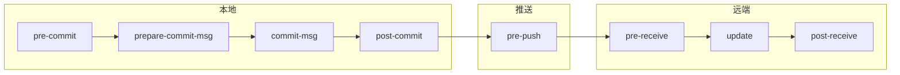

export const metadata = {
  title: "Git Hooks 深入",
  slug: "git-hooks-deep",
  locale: "zh",
  section: "concepts",
  summary: "深入理解 Git Hooks 的类型、生命周期、共享机制以及在 CI/CD 中的集成实践。",
  sourceUrls: [
    "https://git-scm.com/docs/githooks",
    "https://git-scm.com/book/en/v2/Customizing-Git-Git-Hooks",
  ],
};

# Git Hooks 深入

## 概述

Git Hooks 是在 Git 操作的关键节点触发的自定义脚本。它们不是 Git 的内置功能，而是利用 Git 的事件通知机制执行外部程序。

## Hook 生命周期



## 核心 Hook 详解

### 客户端 Hook

| Hook | 触发时机 | 返回值作用 |
|------|---------|-----------|
| `pre-commit` | `git commit` 执行前 | 非零则中止提交 |
| `prepare-commit-msg` | 提交信息编辑器打开前 | 可修改默认信息 |
| `commit-msg` | 提交信息保存后 | 非零则中止提交 |
| `post-commit` | 提交完成后 | 忽略返回值 |
| `pre-push` | `git push` 执行前 | 非零则中止推送 |
| `pre-rebase` | `git rebase` 执行前 | 非零则中止变基 |
| `post-checkout` | `git checkout` 完成后 | 忽略返回值 |
| `post-merge` | `git merge` 完成后 | 忽略返回值 |

### 服务端 Hook

| Hook | 触发时机 | 说明 |
|------|---------|------|
| `pre-receive` | 接收引用更新前 | 可拒绝推送 |
| `update` | 每个引用更新前 | 可逐分支控制 |
| `post-receive` | 引用更新完成后 | 触发 CI、通知 |

## 实用 Hook 示例

### pre-commit：代码质量检查

```bash
#!/bin/bash
# .git/hooks/pre-commit
echo "Running linter..."
npm run lint
if [ $? -ne 0 ]; then
  echo "Lint failed. Commit aborted."
  exit 1
fi
```

### commit-msg：提交信息规范

```bash
#!/bin/bash
# .git/hooks/commit-msg
# 检查提交信息是否符合 Conventional Commits
PATTERN="^(feat|fix|docs|style|refactor|test|chore|ci)(\(.+\))?: .{1,72}"
msg=$(cat "$1")
if ! [[ "$msg" =~ $PATTERN ]]; then
  echo "Error: commit message must match Conventional Commits format"
  echo "  e.g. feat(api): add login endpoint"
  exit 1
fi
```

### pre-push：推送前检查

```bash
#!/bin/bash
# .git/hooks/pre-push
# 防止推送到受保护分支
protected_branches="main master develop"
while read local_ref local_sha remote_ref remote_sha; do
  for branch in $protected_branches; do
    if [[ "$remote_ref" == "refs/heads/$branch" ]]; then
      echo "Error: pushing to $branch is not allowed via hook"
      exit 1
    fi
  done
done
exit 0
```

## 共享 Hooks

### 方案一：放在仓库中（推荐）

```bash
# 项目结构
my-repo/
├── .githooks/
│   ├── pre-commit
│   └── commit-msg
└── .gitignore

# 配置 Git 使用自定义 hooks 目录
git config core.hooksPath .githooks
```

### 方案二：全局 Hooks

```bash
# 创建全局 hooks 目录
mkdir -p ~/.git-hooks
git config --global core.hooksPath ~/.git-hooks

# 放入所有项目共享的 hook
# 比如 ~/.git-hooks/pre-commit
```

### 方案三：使用 husky（Node.js 项目）

```bash
# npm 项目中使用 husky
npx husky init

# .husky/pre-commit
npx lint-staged
```

## CI 集成

### 在 CI 中运行 Hook 检查

```yaml
# GitHub Actions
jobs:
  lint:
    runs-on: ubuntu-latest
    steps:
      - uses: actions/checkout@v4
      - run: npm ci
      - name: Check commit messages
        run: |
          git log --format=%s -1 | grep -E '^(feat|fix|docs)'
```

## 安全注意事项

1. **服务端 Hook 优先**：客户端 Hook 可被用户跳过（`git commit --no-verify`）
2. **不要依赖客户端 Hook 做安全策略**：服务端 `pre-receive` 才是真正的防线
3. **Hook 脚本权限**：确保 Hook 脚本有执行权限（`chmod +x`）
4. **性能影响**：复杂的 Hook 会显著增加 Git 操作延迟

## 继续学习

1. `concepts/git-hooks` — Git Hooks 基础概念
2. `workflows/pre-commit-hook-workflow` — Pre-commit Hook 工作流
3. `concepts/git-lfs-deep` — Git LFS 深入
