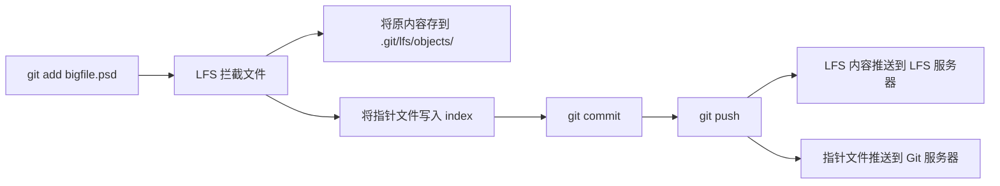

export const metadata = {
  title: "Git LFS 深入",
  slug: "git-lfs-deep",
  locale: "zh",
  section: "concepts",
  summary: "深入理解 Git LFS 的架构原理、性能调优、服务端配置与大规模迁移策略。",
  sourceUrls: [
    "https://git-lfs.com/",
    "https://github.com/git-lfs/git-lfs/blob/main/docs/spec.md",
  ],
  citations: [
    {
      title: "Git lfs.com",
      url: "https://git-lfs.com/",
      kind: "blog",
    },
    {
      title: "github.com — Spec.md",
      url: "https://github.com/git-lfs/git-lfs/blob/main/docs/spec.md",
      kind: "discussion",
    },
  ],
};

# Git LFS 深入

## 学完这篇你会掌握什么

- 理解 Git LFS 深入 的核心作用和适用场景
- 掌握 Git LFS 深入 的基本用法和常用参数
- 深入理解 Git LFS 的架构原理、性能调优、服务端配置与大规模迁移策略。
- 理解 架构原理 相关的概念
- 掌握 服务端配置 相关的操作
- 知道在什么场景下使用该命令，什么场景下避免使用


## 先想一个问题

你在使用 Git 的过程中遇到了一个概念问题——你大概知道它是什么意思，但不太确定它的确切含义和边界，也不太确定自己理解得对不对。

## 架构原理

Git LFS（Large File Storage）通过**指针文件**替换大文件，将实际内容存储在独立的对象存储中。指针文件仅有几十字节，而大文件按需下载。

### 指针文件结构

```text
version https://git-lfs.github.com/spec/v1
oid sha256:4a7c7f... (64 位十六进制哈希)
size 471859200
```

只有 LFS 客户端能识别和解析指针文件。没有安装 LFS 的 Git 客户端只能看到指针文本。

### 工作流程



## 服务端配置

### GitHub

```bash
# 每个仓库最多 2GB LFS 存储（免费）
# 支持 S3 兼容对象存储
```

### GitLab

```yaml
# /etc/gitlab/gitlab.rb
gitlab_rails['lfs_enabled'] = true
gitlab_rails['lfs_storage_path'] = "/var/opt/gitlab/lfs-objects"

# 使用对象存储
gitlab_rails['object_store']['enabled'] = true
gitlab_rails['object_store']['remote_directory'] = 'gitlab-lfs'
gitlab_rails['object_store']['connection'] = {
  'provider' => 'AWS',
  'region' => 'us-east-1',
  'aws_access_key_id' => 'AWS_ACCESS_KEY',
  'aws_secret_access_key' => 'AWS_SECRET_ACCESS_KEY'
}
```

### Gitea

```INI
[server]
LFS_START_SERVER = true
LFS_JWT_SECRET = your-secret-key
LFS_CONTENT_PATH = /data/git/lfs
```

## 性能调优

### 按需下载（Smudge 策略）

```bash
# 默认：检出时下载 LFS 文件
git config --global lfs.fetchinclude "*.psd,*.bin"
git config --global lfs.fetchexclude "*.zip,*.tar.gz"

# Skipping smudge：检出时不下载，按需获取
GIT_LFS_SKIP_SMUDGE=1 git clone https://github.com/user/repo.git
cd repo
git lfs pull --include="*.psd"
```

### 缓存与并行

```bash
# 启用并行上传/下载
git config --global lfs.concurrenttransfers 8

# 设置传输缓存
git config --global lfs.cache-url https://lfs-cache.example.com
```

### 文件清理

```bash
# 查看 LFS 使用情况
git lfs ls-files --size
git lfs ls-files --all

# 清理旧的 LFS 对象（根据指针引用的 prune）
git lfs prune
git lfs prune --dry-run  # 预览
```

## 迁移策略

### 将已有大文件迁移到 LFS

```bash
# 迁移特定文件类型
git lfs migrate import --include="*.psd,*.bin" --everything

# 迁移指定大小的文件
git lfs migrate import --above=10MB --everything
```

### 迁移后检查

```bash
# 验证迁移成功
git lfs fsck --pointers
git lfs ls-files --all | wc -l

# 清理原始大文件引用
git reflog expire --expire-unreachable=now --all
git gc --prune=now
```

### 批量迁移脚本

```bash
#!/bin/bash
# 批量迁移多个仓库
for repo in repo-a repo-b repo-c; do
  cd $repo
  git lfs migrate import --include="*.psd,*.bin" --everything
  git push --force origin main
  cd ..
done
```

## 最佳实践

1. **尽早引入 LFS**：仓库越小迁移成本越低
2. **精确的文件匹配**：用 `--include` 明确文件类型，避免误匹配
3. **定期清理**：运行 `git lfs prune` 移除本地不需要的对象
4. **CI 优化**：在 CI 中使用 `GIT_LFS_SKIP_SMUDGE=1` 避免不必要的下载
5. **备份 LFS 存储**：LFS 对象存储需要独立备份策略

## 继续学习

1. `concepts/git-lfs` — Git LFS 基础概念
2. `concepts/git-hooks-deep` — Git Hooks 深入
3. `performance/large-repo-optimization` — 大型仓库优化

## 给你的练习

1. 在一个测试仓库中练习该命令的基本用法，观察执行前后的状态变化
2. 尝试该命令的不同参数选项，对比输出结果的差异
3. 模拟一个需要使用该命令的实际场景，完整走一遍操作流程

{/* internal-links:auto */}

## 延伸阅读

沿着同一主题继续深入：

- [.gitignore 完整指南](/zh/concepts/git-ignore)
- [Git LFS 大文件存储](/zh/concepts/git-lfs)
- [Git Merge 深入](/zh/concepts/git-merge-deep)

