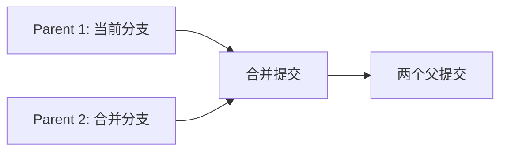

export const metadata = {
  title: "Git Merge 深入",
  slug: "git-merge-deep",
  locale: "zh",
  section: "concepts",
  summary: "深入理解 Git Merge 策略、递归合并、Ours/Theirs、Octopus 合并与冲突解决机制。",
  sourceUrls: [
    "https://git-scm.com/docs/git-merge",
    "https://git-scm.com/docs/merge-strategies",
  ],
  citations: [
    {
      title: "Git merge",
      url: "https://git-scm.com/docs/git-merge",
      kind: "official",
    },
    {
      title: "Merge strategies",
      url: "https://git-scm.com/docs/merge-strategies",
      kind: "official",
    },
  ],
};

# Git Merge 深入

## 学完这篇你会掌握什么

- 理解 Git Merge 深入 的核心作用和适用场景
- 掌握 Git Merge 深入 的基本用法和常用参数
- 深入理解 Git Merge 策略、递归合并、Ours/Theirs、Octopus 合并与冲突解决机制。
- 理解 概述 相关的概念
- 掌握 合并策略 相关的操作
- 知道在什么场景下使用该命令，什么场景下避免使用


## 先想一个问题

你在使用 Git 的过程中遇到了一个概念问题——你大概知道它是什么意思，但不太确定它的确切含义和边界，也不太确定自己理解得对不对。

## 概述

`git merge` 是将两个或多个开发历史合并的核心命令。Git 支持多种合并策略，默认使用 **recursive（递归）** 策略。

## 合并策略

### 1. Recursive（递归，默认）

```bash
git merge feature
# 等同于
git merge -s recursive feature
```

**特点**：
- 三方合并（common ancestor + two heads）
- 自动检测重命名
- 支持 `ours`、`theirs` 子策略处理冲突

```bash
# 冲突时自动选择当前分支版本
git merge -s recursive -X ours feature

# 冲突时自动选择合并分支版本
git merge -s recursive -X theirs feature

# 忽略空白变化
git merge -s recursive -X ignore-space-change feature
```

### 2. Ort（Ostensibly Recursive's Twin）

Git 2.32+ 新策略，recursive 的现代替代：
- 性能更好（特别是大型仓库）
- 冲突检测更准确
- 默认在 Git 2.37+ 启用

```bash
git merge -s ort feature
```

### 3. Ours（忽略对方）

```bash
git merge -s ours feature
```
- 结果树完全等于当前分支
- 仅记录合并提交，不引入任何变更
- 用于：记录已在别处合并的分支、废弃分支标记

### 4. Theirs（采纳对方）

```bash
git merge -s theirs feature
```
- 结果树完全等于合并分支
- 注意：这是策略层面的，非 `-X theirs`（后者是冲突解决选项）

### 5. Octopus（多头合并）

```bash
git merge branch1 branch2 branch3
```
- 同时合并多个分支（>2 个头）
- 仅当无冲突时可用
- 常用于发布集成：`git merge feature-a feature-b feature-c`

### 6. Resolve（传统三方合并）

```bash
git merge -s resolve feature
```
- 旧式三方合并算法
- 处理重命名/复杂历史较弱
- 仅用于兼容极旧版本 Git

## 冲突解决机制

### 冲突标记

```text
<<<<<<< HEAD
当前分支内容
=======
合并分支内容
>>>>>>> feature
```

### 解决工具

```bash
# 启动合并工具
git mergetool

# 常用工具：vimdiff, kdiff3, meld, vscode
git config --global merge.tool vscode
```

### 冲突解决选项

| 选项 | 作用 |
|------|------|
| `-X ours` | 冲突时选当前分支 |
| `-X theirs` | 冲突时选合并分支 |
| `-X ignore-space-change` | 忽略空白冲突 |
| `-X ignore-all-space` | 完全忽略空白 |
| `-X rename-threshold=N` | 重命名检测阈值 (默认 50%) |

## 合并提交结构

```bash
# 普通合并（非快进）
git merge --no-ff feature

# 快进合并（默认，如果可能）
git merge feature

# 禁止快进，强制创建合并提交
git merge --no-ff feature
```

### 合并提交的特殊性



合并提交有**两个父提交**，这使得：
- `git log --first-parent` 只显示主线历史
- `git log --all` 显示完整拓扑

## 高级用法

### 合并特定文件/目录

```bash
# 从另一分支合并单个文件
git checkout feature -- path/to/file
# 或
git restore -s feature -- path/to/file

# 合并子目录（保留历史）
git merge -s subtree feature
```

### Squash Merge（压缩合并）

```bash
# 将所有提交压缩为单个提交
git merge --squash feature
git commit
```
- 不创建合并提交（单父提交）
- 丢失分支拓扑信息
- GitHub/GitLab PR 的 "Squash and merge" 即此模式

### 验证合并前状态

```bash
# 预览合并结果（不提交）
git merge --no-commit --no-ff feature
git diff HEAD
git merge --abort  # 取消
```

## 最佳实践

1. **功能分支用 `--no-ff`**——保留分支拓扑，便于回溯
2. **发布分支用 Octopus**——一次性集成多个特性
3. **自动化冲突用 `-X` 选项**——CI 中减少人工干预
4. **定期合并上游**——减少大冲突概率
5. **保护主分支**——要求 PR + review，禁止直接推送

## 常见问题

| 问题 | 原因 | 解决 |
|------|------|------|
| "Already up to date" | 对方已是祖先 | 无需合并 |
| "Not possible to fast-forward" | 历史分叉 | 用 `--no-ff` 或 rebase 后合并 |
| 大量冲突 | 长期分离 | 定期合并上游，或用 rebase 同步 |
| 合并提交过多 | 频繁合并主线 | 用 rebase 代替合并同步 |

## 继续学习

1. `commands/git-merge` — git merge 命令参考
2. `internals/three-way-merge-mechanics` — 三方合并原理
3. `concepts/merge-strategies` — 合并策略对比
4. `concepts/git-rebase-deep` — Git Rebase 深入

## 给你的练习

1. 在一个测试仓库中练习该命令的基本用法，观察执行前后的状态变化
2. 尝试该命令的不同参数选项，对比输出结果的差异
3. 模拟一个需要使用该命令的实际场景，完整走一遍操作流程

