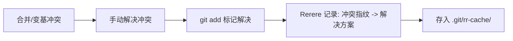

export const metadata = {
  title: "Git Rerere 深入",
  slug: "git-rerere-deep",
  locale: "zh",
  section: "concepts",
  summary: "掌握 Git Rerere（重用记录的冲突解决）的配置、工作流集成、存储机制与团队共享策略。",
  sourceUrls: [
    "https://git-scm.com/docs/git-rerere",
    "https://git-scm.com/book/en/v2/Git-Tools-Rerere",
  ],
  citations: [
    {
      title: "Git rerere",
      url: "https://git-scm.com/docs/git-rerere",
      kind: "official",
    },
    {
      title: "Git Tools Rerere",
      url: "https://git-scm.com/book/en/v2/Git-Tools-Rerere",
      kind: "book",
    },
  ],
};

# Git Rerere 深入

## 学完这篇你会掌握什么

- 理解 Git Rerere 深入 的核心作用和适用场景
- 掌握 Git Rerere 深入 的基本用法和常用参数
- 掌握 Git Rerere（重用记录的冲突解决）的配置、工作流集成、存储机制与团队共享策略。
- 理解 概述 相关的概念
- 掌握 启用与配置 相关的操作
- 知道在什么场景下使用该命令，什么场景下避免使用


## 先想一个问题

你在使用 Git 的过程中遇到了一个概念问题——你大概知道它是什么意思，但不太确定它的确切含义和边界，也不太确定自己理解得对不对。

## 概述

**Rerere = Reuse Recorded Resolution**（重用记录的冲突解决）。它让 Git 记住你如何解决冲突，下次遇到相同冲突时**自动复用**解决方案。

## 启用与配置

```bash
# 全局启用（推荐）
git config --global rerere.enabled true

# 项目级启用
git config rerere.enabled true

# 内存缓存大小（默认 1000）
git config --global rerere.maxMemory 1000

# 磁盘存储过期天数（默认 60）
git config --global rerere.autoupdate true
```

### 关键配置项

| 配置 | 默认 | 说明 |
|------|------|------|
| `rerere.enabled` | false | 启用 rerere |
| `rerere.autoupdate` | false | 自动更新索引（标记冲突已解决） |
| `rerere.maxMemory` | 1000 | 内存缓存条目数 |
| `rerere.maxDiskUsage` | 0 (无限) | 磁盘最大字节数 |

## 工作原理

### 冲突解决记录



### 冲突指纹

Git 通过冲突块的**上下文哈希**生成唯一指纹：
- 冲突标记前后的 3 行上下文
- 双方内容的哈希
- 文件路径

相同指纹 = 相同冲突 = 可复用解决。

## 基本工作流

### 场景 1：长期特性分支反复合并主线

```bash
# 启用后正常工作
git merge main
# 冲突 -> 手动解决 -> git add -> git commit
# Rerere 自动记录

# 两周后再次合并
git merge main
# 相同冲突自动解决！无需手动干预
```

### 场景 2：变基时重复解决相同冲突

```bash
git rebase main
# 冲突 -> 解决 -> git rebase --continue
# 记录保存

# 后续变基同一分支
git rebase main
# 自动应用之前的解决
```

### 场景 3：跨分支 Cherry-pick

```bash
git cherry-pick feature-commit
# 冲突解决记录

# 另一分支 cherry-pick 同一提交
git checkout other-branch
git cherry-pick feature-commit
# 自动复用解决
```

## 命令参考

### 查看记录

```bash
# 列出所有记录的冲突
git rerere

# 显示特定冲突的解决方案
git rerere diff <file>

# 查看缓存状态
git rerere status
```

### 管理记录

```bash
# 清除特定文件的记录
git rerere forget <file>

# 清除所有记录
git rerere clear

# 显示剩余未解决冲突
git rerere remaining
```

### 手动应用/保存

```bash
# 手动触发记录（解决冲突后）
git rerere

# 手动应用记录（冲突时）
git rerere apply <file>
```

## 团队共享 Rerere 缓存

### 方案 1：提交到仓库（不推荐）

```bash
# .git/rr-cache/ 不应提交
# 原因：二进制缓存，跨平台/版本不兼容
```

### 方案 2：共享脚本初始化（推荐）

```bash
# 仓库包含预置解决方案
# scripts/setup-rerere.sh
#!/bin/bash
git config rerere.enabled true
# 从共享存储恢复（如对象存储、NFS）
rsync -a shared-rerere-cache/ .git/rr-cache/
```

### 方案 3：CI 自动收集

```yaml
# .github/workflows/rerere.yml
jobs:
  collect-rerere:
    runs-on: ubuntu-latest
    steps:
      - uses: actions/checkout@v4
      - name: Merge main to collect rerere
        run: |
          git config rerere.enabled true
          git merge origin/main --no-commit || true
          # 冲突解决记录自动保存
      - name: Upload rerere cache
        uses: actions/upload-artifact@v4
        with:
          name: rerere-cache
          path: .git/rr-cache/
```

## 存储结构

```
.git/rr-cache/
├── <hash1>/
│   ├── preimage     # 冲突前状态
│   ├── postimage    # 解决后状态
│   └── thisimage    # 当前工作区状态（用于匹配）
├── <hash2>/
│   └── ...
└── MERGE_RR        # 当前合并的冲突列表
```

### 缓存匹配流程

1. 冲突发生 → 计算指纹
2. 在 `rr-cache/` 查找匹配指纹
3. 找到 → 复用 `postimage` 覆盖工作区
4. `autoupdate=true` → 自动 `git add` 标记解决

## 高级用法

### 训练 Rerere（预录制解决方案）

```bash
# 创建测试冲突场景
git checkout -b test-conflict main
echo "conflict content" > file.txt
git commit -am "base"

git checkout -b other main
echo "other content" > file.txt
git commit -am "other"

# 制造冲突并解决
git merge test-conflict
# 解决冲突
git add file.txt
git commit
# 此时记录已保存，可分享给团队
```

### 与 `git merge --no-commit` 配合

```bash
# 预览合并，自动应用 rerere
git merge --no-commit feature
# rerere 自动解决已知冲突
git status  # 查看剩余冲突
git commit
```

### 调试冲突解决

```bash
# 显示当前冲突的指纹
git rerere diff

# 查看 preimage/postimage
cat .git/rr-cache/<hash>/preimage
cat .git/rr-cache/<hash>/postimage
```

## 最佳实践

1. **全局启用 `rerere.enabled=true`**——零成本，收益巨大
2. **开启 `autoupdate`**——自动标记解决，减少 `git add`
3. **长期分支必用**——每周合并主线时自动解决 90%+ 冲突
4. **团队共享预置缓存**——CI 收集、分发常见冲突解决
5. **定期清理**——`git rerere clear` 避免缓存膨胀

## 常见问题

| 问题 | 原因 | 解决 |
|------|------|------|
| 冲突未自动解决 | 指纹不匹配（上下文变化） | 手动解决一次即记录 |
| 误记录错误解决 | 解决后未检查直接提交 | `git rerere forget <file>` 删除 |
| 缓存过大 | 长期积累 | 设置 `rerere.maxDiskUsage` |
| 跨平台失效 | 换行符/编码差异 | 统一 `.gitattributes` 规范化 |

## 继续学习

1. `commands/git-rerere` — git rerere 命令参考
2. `workflows/rerere-for-recurring-conflicts` — 循环冲突工作流
3. `concepts/git-merge-deep` — Git Merge 深入
3. `concepts/git-rebase-deep` — Git Rebase 深入

## 给你的练习

1. 在一个测试仓库中练习该命令的基本用法，观察执行前后的状态变化
2. 尝试该命令的不同参数选项，对比输出结果的差异
3. 模拟一个需要使用该命令的实际场景，完整走一遍操作流程

{/* internal-links:auto */}

## 延伸阅读

沿着同一主题继续深入：

- [Git Rebase 深入](/zh/concepts/git-rebase-deep)
- [Git 浅克隆与浅操作](/zh/concepts/git-shallow)
- [Git Subtree 使用指南](/zh/concepts/git-subtree)

