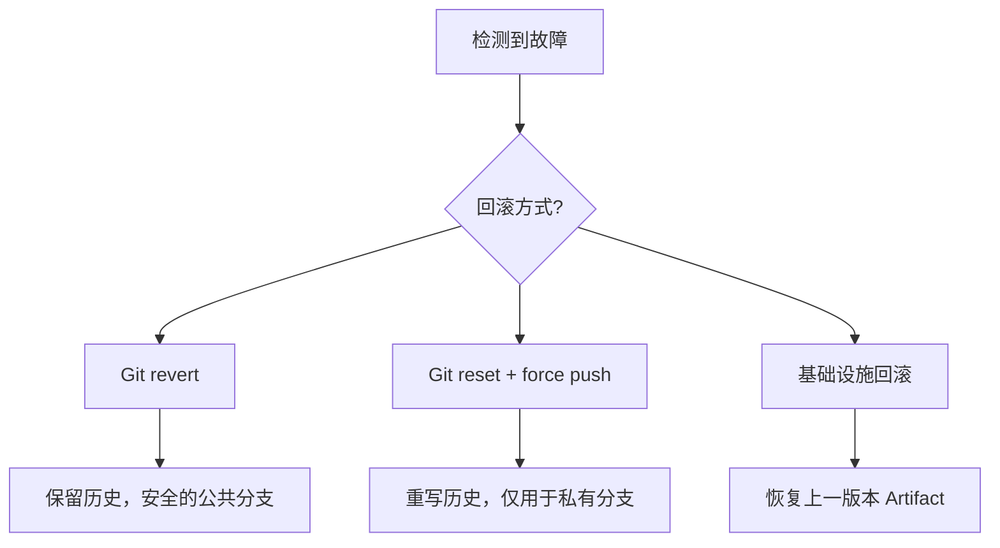

export const metadata = {
  title: "CI/CD 部署策略与 Git 版本管理",
  slug: "ci-cd-deployment-strategies",
  locale: "zh",
  section: "devops",
  summary: "全面介绍基于 Git 标签的部署策略，包括环境晋升（开发→预发→生产）、金丝雀发布、GitOps 部署模式以及利用 Git revert 实现回滚的最佳实践。",
  sourceUrls: [
    "https://trunkbaseddevelopment.com/",
    "https://www.gitops.tech/",
  ],
  citations: [
    {
      title: "Trunkbaseddevelopment.com",
      url: "https://trunkbaseddevelopment.com/",
      kind: "blog",
    },
    {
      title: "Www.gitops.tech",
      url: "https://www.gitops.tech/",
      kind: "blog",
    },
  ],
};

# CI/CD 部署策略与 Git 版本管理

## 学完这篇你会掌握什么

- 理解 CI/CD 部署策略与 Git 版本管理 的核心作用和适用场景
- 掌握 CI/CD 部署策略与 Git 版本管理 的基本用法和常用参数
- 全面介绍基于 Git 标签的部署策略，包括环境晋升（开发→预发→生产）、金丝雀发布、GitOps 部署模式以及利用 Git revert 实现回滚的最佳实践。
- 理解 Git Tag 基部署 相关的概念
- 掌握 环境晋升 相关的操作
- 知道在什么场景下使用该命令，什么场景下避免使用


## 先想一个问题

你的团队正在引入 CI/CD，或者你正在配置 IDE 中的 Git 集成——但你不确定在自动化的场景下，Git 的行为和本地手动操作有什么不同，需要注意什么安全问题。

## 一句话理解

将 Git 作为部署的核心控制层，利用标签、分支和提交历史定义环境晋升路径，实现可追溯、可回滚的自动化发布流程。

## Git Tag 基部署

### 语义版本标签

```yaml
# GitHub Actions - Tag 触发部署
on:
  push:
    tags:
      - "v*"

jobs:
  deploy:
    steps:
      - uses: actions/checkout@v4
        with:
          fetch-tags: true
      - run: |
          VERSION=${GITHUB_REF_NAME#v}
          echo "Deploying version $VERSION to production"
          ./deploy.sh "$VERSION"
```

### 基于 `git describe` 的版本推断

```yaml
- run: |
    git fetch --tags origin
    VERSION=$(git describe --tags --abbrev=0 --match "v*" 2>/dev/null || echo "v0.0.0")
    BUILD_META=$(git rev-parse --short HEAD)
    echo "FULL_VERSION=${VERSION}+${BUILD_META}" >> $GITHUB_ENV
```

## 环境晋升

### 三阶段晋升模型

```
Feature Branch → Develop (Dev Env) → Main (Staging Env) → Tag (Production Env)
```

### 环境晋升流水线

```yaml
# GitLab CI - 环境晋升
stages:
  - build
  - deploy-dev
  - deploy-staging
  - deploy-prod

build:
  stage: build
  script: npm run build
  artifacts:
    paths:
      - dist/

deploy-dev:
  stage: deploy-dev
  script: deploy-to-dev
  environment:
    name: development
    url: https://dev.example.com
  rules:
    - if: $CI_COMMIT_BRANCH == "develop"

deploy-staging:
  stage: deploy-staging
  script: deploy-to-staging
  environment:
    name: staging
    url: https://staging.example.com
  rules:
    - if: $CI_COMMIT_BRANCH == "main"

deploy-prod:
  stage: deploy-prod
  script: deploy-to-prod
  environment:
    name: production
    url: https://example.com
  rules:
    - if: $CI_COMMIT_TAG
      when: manual  # 需要人工确认
```

### 环境晋升检查清单

| 环境 | 触发条件 | 部署方式 | 验证要求 |
|------|---------|---------|---------|
| Dev | Push develop | 自动 | 单元测试通过 |
| Staging | PR 合并到 main | 自动 | 集成测试通过 |
| Prod | Tag push | 手动确认 | 全部测试 + 审批 |

## 金丝雀发布与 Git

### 基于 Git 分支的金丝雀策略

```yaml
jobs:
  canary:
    steps:
      - checkout
      - run: |
          if [ "$CIRCLE_BRANCH" = "canary" ]; then
            ./deploy-canary.sh  # 部署到 10% 的实例
            sleep 300           # 观察 5 分钟
            ./promote-canary.sh # 如果稳定则全量发布
          fi
```

### 渐进式流量切换

```yaml
- run: |
    # 基于 Git 提交的灰度百分比
    COMMIT_HASH=$(git rev-parse --short HEAD)
    CANARY_PERCENT=$(( 0x${COMMIT_HASH:0:2} % 100 ))
    echo "Canary traffic: ${CANARY_PERCENT}%"
    ./deploy-weighted.sh "${CANARY_PERCENT}"
```

## GitOps 部署模式

### GitOps 核心原则

```
Git Repository (唯一真相源)
       ↓
  CI Pipeline (构建 & 测试)
       ↓
GitOps Operator (如 ArgoCD / Flux)
       ↓
  Target Environment
```

### ArgoCD 示例

```yaml
# argo-application.yaml
apiVersion: argoproj.io/v1alpha1
kind: Application
metadata:
  name: my-app
spec:
  source:
    repoURL: https://github.com/org/manifests.git
    targetRevision: main  # Git 分支作为环境配置源
    path: overlays/production
  destination:
    server: https://kubernetes.default.svc
    namespace: production
  syncPolicy:
    automated:
      prune: true
      selfHeal: true
```

### Flux CD 示例

```yaml
apiVersion: kustomize.toolkit.fluxcd.io/v1
kind: Kustomization
metadata:
  name: apps
spec:
  interval: 5m
  sourceRef:
    kind: GitRepository
    name: flux-system
  path: ./apps/production
  prune: true
```

## 回滚策略

### Git Revert 回滚

```yaml
# CI 中的自动回滚
jobs:
  rollback:
    steps:
      - uses: actions/checkout@v4
        with:
          fetch-depth: 0
      - run: |
          # 找到上一个稳定版本
          LAST_STABLE=$(git tag --sort=-version:refname | head -2 | tail -1)
          echo "Rolling back to: $LAST_STABLE"
          git revert --no-commit HEAD
          git commit -m "Revert to $LAST_STABLE [rollback]"
          git push
          # 触发放置回退版本的部署
          git tag -f "rollback-$(date +%Y%m%d%H%M)" HEAD
          git push --tags -f
```

### 渐进式回滚

```yaml
- run: |
    # 逐步降低故障版本的流量
    for p in 100 75 50 25 0; do
      echo "Shifting traffic to ${p}% stable version"
      ./shift-traffic.sh "$p"
      sleep 60
    done
```

### 回滚决策树



## 给你的练习

1. 在一个测试仓库中练习该命令的基本用法，观察执行前后的状态变化
2. 尝试该命令的不同参数选项，对比输出结果的差异
3. 模拟一个需要使用该命令的实际场景，完整走一遍操作流程

## 继续学习建议

1. `ci-cd/ci-cd-testing-strategies` — CI/CD 测试策略与 Git 集成
2. `ci-cd/circleci-git` — CircleCI 与 Git 集成
3. `ci-cd/ci-security-basics` — CI/CD 中的 Git 安全基础
