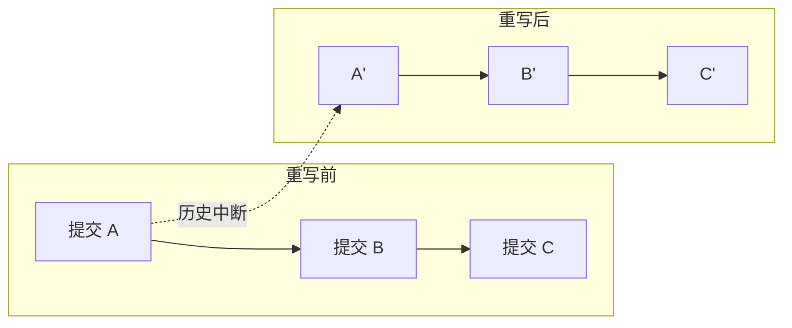

export const metadata = {
  title: "git filter-repo 仓库重写深入",
  slug: "git-filter-repo",
  locale: "zh",
  section: "migration",
  author: "lance-mq",
  summary: "深入解析 git filter-repo 工具，涵盖仓库拆分、文件清理、作者信息重写等高级用法，以及与 filter-branch 和 BFG 的对比。",
  sourceUrls: ["https://github.com/newren/git-filter-repo"],
  citations: [
    {
      title: "Git filter repo",
      url: "https://github.com/newren/git-filter-repo",
      kind: "discussion",
    },
  ],
};

## 先想一个问题

你的团队正在从其他版本控制系统迁移到 Git，或者需要在不同 Git 平台之间迁移代码和历史。你担心迁移过程中会不会丢失提交记录或作者信息。

## 一句话理解

git filter-repo 是 Git 官方推荐的仓库历史重写工具，比 filter-branch 快数十倍，比 BFG 更灵活，是仓库清理和拆分的不二之选。

## git filter-repo 是什么

git filter-repo 是由 Elijah Newren 开发的 Python 工具，现已作为 Git 官方推荐的历史重写工具。它通过直接读取和重写 Git 对象数据库来工作，避免了 filter-branch 逐 shell 命令处理的性能瓶颈。

```bash
# 安装

## 学完这篇你会掌握什么

- 理解 安装 的核心作用和适用场景
- 掌握 安装 的基本用法和常用参数
- 深入解析 git filter-repo 工具，涵盖仓库拆分、文件清理、作者信息重写等高级用法，以及与 filter-branch 和 BFG 的对比。
- 理解 git filter-repo 是什么 相关的概念
- 掌握 核心使用场景 相关的操作
- 知道在什么场景下使用该命令，什么场景下避免使用

brew install git-filter-repo
# 或 pip
pip install git-filter-repo
```

核心设计理念：速度快（利用 Python 的批量处理能力）、安全（默认不对裸仓库操作）、灵活（通过 Python 回调支持自定义逻辑）。

## 核心使用场景

### 仓库拆分

从单体仓库中提取某个子目录作为独立仓库：

```bash
# 将 subdir/ 提取为新仓库，保留该路径的完整历史
git filter-repo --path subdir/ --subdirectory-filter .
```

### 文件清理

永久删除敏感文件或大文件：

```bash
# 删除指定文件的所有历史记录
git filter-repo --path passwords.txt --path secrets/ --invert-paths

# 删除所有超过 10MB 的文件
git filter-repo --strip-blobs-bigger-than 10M
```

### 重写作者信息

统一仓库中的作者姓名和邮箱：

```bash
# 创建邮箱映射文件
cat > mailmap.txt << EOF
old@corp.com New Name <new@corp.com>
another@corp.com Another Name <another@corp.com>
EOF

git filter-repo --mailmap mailmap.txt
```

### 按路径过滤

保留特定路径，删除其余所有内容：

```bash
# 只保留 src/ 和 README.md 的历史
git filter-repo --path src/ --path README.md
```

## 与 filter-branch 和 BFG 的对比

| 特性 | git filter-repo | git filter-branch | BFG Repo-Cleaner |
|------|----------------|-------------------|------------------|
| 性能 | 极快（数分钟处理数万提交） | 慢（逐提交 fork 进程） | 快（专注大文件删除） |
| 灵活性 | 极高（Python 回调） | 中（shell 表达式） | 低（预设操作） |
| 安全性 | 默认保留 refs/backup | 部分支持 | 无内置备份 |
| 多路径 | 原生支持 | 需脚本组合 | 不支持 |
| 作者重写 | 内置 mailmap 支持 | 需自定义 | 支持 |
| 维护状态 | 活跃维护 | 已弃用 | 归档状态 |

### 性能基准测试

实测对比（10 万提交、500MB 仓库，删除单个大文件）：

- git filter-branch: ~45 分钟
- BFG: ~3 分钟
- git filter-repo: ~45 秒

## 高级模式：Python 回调

git filter-repo 真正的威力在于回调机制，允许使用 Python 完全控制历史重写逻辑：

```python
# callback.py: 自定义提交过滤逻辑
def commit_callback(commit, metadata):
    # 只保留包含特定关键字的提交
    if b"WIP" in commit.message:
        return False  # 跳过 WIP 提交
    # 在提交信息末尾追加处理时间戳
    commit.message += b"\nProcessed by git-filter-repo"
    return True

def blob_callback(blob, metadata):
    # 替换所有 blob 中的敏感 URL
    old_url = b"http://old-server.com"
    new_url = b"https://new-server.com"
    if old_url in blob.data:
        blob.data = blob.data.replace(old_url, new_url)
```

```bash
# 使用回调
git filter-repo --refs HEAD --force --callback callback.py
```

高级回调还能实现：按文件内容过滤（删除包含特定模式的 blob）、繁简代码转换、许可证头替换等。

## 共享历史的安全考虑

历史重写会更改所有后续提交的 SHA-1，导致与其他仓库克隆的历史不兼容。安全准则：

1. **沟通先行**：重写前通知所有协作者，确定统一的时间窗口
2. **上游关闭**：重写期间禁止推送
3. **强制推送**：使用 `git push --force-with-lease`（比 `--force` 更安全）
4. **标记备份**：重写前创建备份引用

```bash
# 重写前的安全备份
git tag pre-rewrite-backup
git push origin pre-rewrite-backup

# 对已推送的仓库执行重写
git filter-repo --path src/ --refs HEAD --force
git remote add origin <new-url>
git push --force-with-lease origin main
```

5. **团队协调**：所有协作者需要重新 clone 重写后的仓库

```bash
# 协作者操作
git fetch --all
git rebase --onto origin/main origin/main-pre-rewrite main
```

## 可视化重写影响



每个提交的哈希都发生变化，这就是为什么必须强制推送并通知所有协作者。

## 给你的练习

1. 在一个测试仓库中练习该命令的基本用法，观察执行前后的状态变化
2. 尝试该命令的不同参数选项，对比输出结果的差异
3. 模拟一个需要使用该命令的实际场景，完整走一遍操作流程

## 继续学习建议

- 查看 [迁移策略指南](./migration-strategy-guide) 将 filter-repo 用于迁移后清理
- 阅读官方文档：[git filter-repo GitHub](https://github.com/newren/git-filter-repo)
- 进阶阅读：Git 官方教程 [Rewriting History](https://git-scm.com/book/en/v2/Git-Tools-Rewriting-History)

{/* internal-links:auto */}

## 延伸阅读

沿着同一主题继续深入：

- [Azure DevOps (TFS) 到 Git 迁移](/zh/migration/azure-devops-migration)
- [Perforce 迁移到 Git](/zh/migration/git-p4-perforce)
- [Mercurial 到 Git 迁移指南](/zh/migration/hg-to-git)

