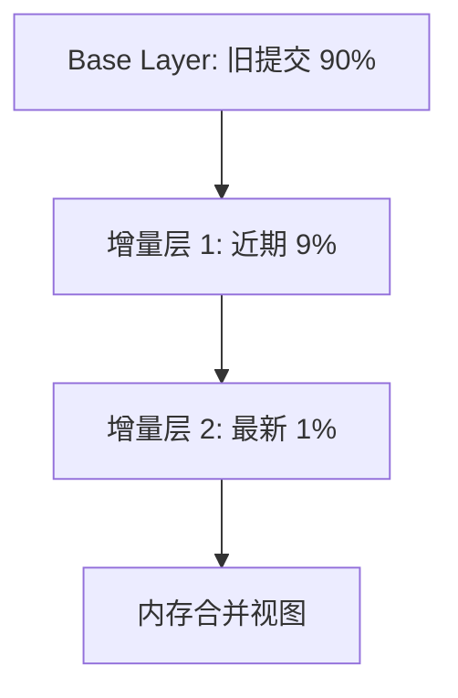

export const metadata = {
  title: "Commit Graph 深入",
  slug: "commit-graph-deep",
  locale: "zh",
  section: "performance",
  summary: "深入理解 Git Commit Graph 的分层结构、Generation Number、Bloom Filter 与大型仓库加速原理。",
  sourceUrls: [
    "https://git-scm.com/docs/git-commit-graph",
    "https://github.com/git/git/blob/master/Documentation/technical/commit-graph.txt",
  ],
  citations: [
    {
      title: "Git commit graph",
      url: "https://git-scm.com/docs/git-commit-graph",
      kind: "official",
    },
    {
      title: "Commit graph.txt",
      url: "https://github.com/git/git/blob/master/Documentation/technical/commit-graph.txt",
      kind: "discussion",
    },
  ],
};

# Commit Graph 深入

## 学完这篇你会掌握什么

- 理解 Commit Graph 深入 的核心作用和适用场景
- 掌握 Commit Graph 深入 的基本用法和常用参数
- 深入理解 Git Commit Graph 的分层结构、Generation Number、Bloom Filter 与大型仓库加速原理。
- 理解 概述 相关的概念
- 掌握 为什么需要 Commit Graph 相关的操作
- 知道在什么场景下使用该命令，什么场景下避免使用


## 先想一个问题

你的 Git 仓库越来越大，clone 越来越慢，日常操作也开始卡顿。你想知道有哪些方法可以优化，又不确定哪些优化手段适合自己的项目场景。

## 概述

**Commit Graph** 是 Git 的加速索引，将提交拓扑信息序列化到二进制文件，使 `git log`、`git merge-base`、`git bisect` 等操作从 O(N) 降为 O(log N) 甚至 O(1)。

## 为什么需要 Commit Graph

### 传统提交遍历问题

```bash
# 无 commit-graph 时
git log --oneline -100
# Git 必须：
# 1. 读取每个提交对象
# 2. 解析父提交链接
# 3. 构建内存拓扑
# 复杂度：O(N) 读取 + O(N) 解析
```

大型仓库（如 Linux 内核 100万+ 提交）冷启动 `git log` 可耗时数秒。

### Commit Graph 解决方案

- **预计算**拓扑信息（父提交、世代号、提交时间）
- **二进制格式**一次性 mmap 读取
- **增量更新**仅处理新提交

## 文件结构

### 存储位置

```
.git/objects/info/commit-graph           # 单文件模式
.git/objects/info/commit-graphs/         # 分层模式 (Git 2.23+)
├── commit-graph-chain                  # 链文件列表
├── commit-graph-<hash>.graph           # 基础层
├── commit-graph-<hash>.graph           # 增量层 1
└── ...
```

### 分层模式



- **Base layer**: 历史提交，只读，极少变化
- **增量层**: 新提交，频繁重写
- 自动合并：增量层过多时自动重写基础层

## 核心数据结构

### 1. Generation Number（世代号）

```text
Definition: 到达无父提交的最大距离
- 根提交: generation = 1
- 单父提交: generation = parent.generation + 1
- 合并提交: generation = max(parents.generation) + 1
```

**作用**：快速判断祖先关系
- `A.generation > B.generation` → A 不可能是 B 的祖先
- 避免完整拓扑遍历

### 2. Commit Date（提交时间）

用于拓扑排序、`git log --date-order` 等。

### 3. Parent Pointers（父指针）

存储为提交图数组索引，而非对象 ID，节省空间且加速遍历。

### 4. Bloom Filter（布隆过滤器，Git 2.32+）

```text
用途：加速路径过滤（git log -- <path>）
原理：每个提交存储修改路径的 Bloom Filter
查询：检查路径是否"可能"在提交中修改
- false positive 可能，false negative 不可能
```

配置：
```bash
git config --global core.commitGraphGenerationVersion 2
git commit-graph write --reachable --bloom-filter=256
```

## 生成与维护

### 手动生成

```bash
# 全量生成（所有可达提交）
git commit-graph write --reachable

# 增量生成（仅新提交）
git commit-graph write --changed-paths --bloom-filter=256

# 分层写入
git commit-graph write --split=replace
```

### 自动维护

```bash
# 启用自动写入（配合 git maintenance）
git config --global core.commitGraph true
git config --global maintenance.commit-graph.enabled true
git maintenance start
```

### 验证

```bash
# 读取并验证
git commit-graph verify

# 显示统计
git commit-graph read --object-dir=.git/objects
```

## 性能影响

| 操作 | 无 Commit Graph | 有 Commit Graph | 提升 |
|------|----------------|----------------|------|
| `git log --oneline -100` | ~2-5s | ~50ms | 40-100x |
| `git merge-base A B` | O(N) | O(log N) | 10-50x |
| `git bisect` | O(N log N) | O(log² N) | 5-20x |
| `git log -- <path>` | 全量扫描 | Bloom Filter | 10-100x |

## 高级配置

### Generation Version

```bash
# v1: 经典 generation number
# v2: 修正后的 generation number（更准确，Git 2.30+ 默认）
git config --global core.commitGraphGenerationVersion 2
```

### Bloom Filter 设置

```bash
# bloom-filter=<bits per entry>
# 推荐 256（平衡大小与精度）
git commit-graph write --bloom-filter=256 --changed-paths
```

### 分层策略

```bash
# 当增量层超过 N 个时合并
git config --global commitGraph.splitMergeThreshold 8

# 最大层数
git config --global commitGraph.maxNewLayers 64
```

## 故障排查

### 损坏恢复

```bash
# 删除损坏的 commit-graph
rm -rf .git/objects/info/commit-graph*

# 重新生成
git commit-graph write --reachable
```

### 兼容性

- Git < 2.18: 不支持
- Git 2.18-2.22: 单文件模式
- Git 2.23+: 分层模式（推荐）
- Git 2.30+: Generation v2
- Git 2.32+: Bloom Filter

## 最佳实践

1. **所有大型仓库启用**——`git config core.commitGraph true`
2. **配合 `git maintenance` 自动维护**——无感知更新
3. **开启 Bloom Filter**——`git log -- <path>` 加速显著
4. **使用 Generation v2**——更准确的祖先判断
5. **CI 中预生成**——`git commit-graph write --reachable` 加速后续作业

## 继续学习

1. `internals/commit-graph` — Commit Graph 内部结构
2. `performance/git-maintenance` — 自动维护框架
3. `concepts/git-bisect-deep` — Bisect 利用 Commit Graph
4. `commands/git-commit-graph` — 命令参考

## 给你的练习

1. 在一个测试仓库中练习该命令的基本用法，观察执行前后的状态变化
2. 尝试该命令的不同参数选项，对比输出结果的差异
3. 模拟一个需要使用该命令的实际场景，完整走一遍操作流程

