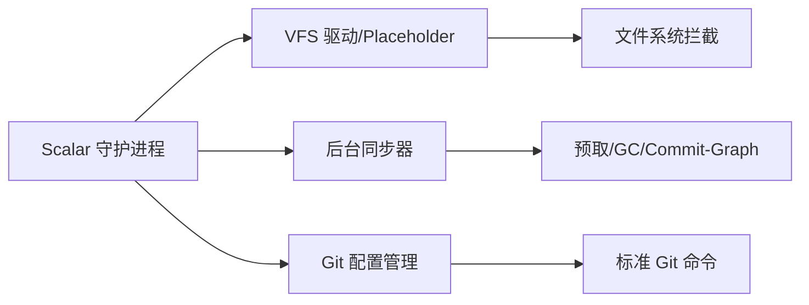
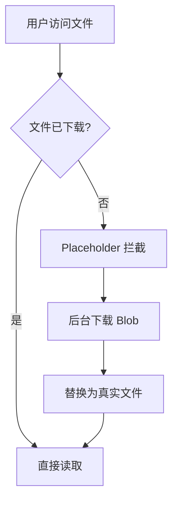

export const metadata = {
  title: "Scalar Git 深入",
  slug: "scalar-git",
  locale: "zh",
  section: "performance",
  author: "lance-mq",
  summary: "了解 Scalar（原 GVFS）：微软为超大型仓库设计的虚拟文件系统与后台同步工具，实现按需下载与标准 Git 兼容。",
  sourceUrls: [
    "https://github.com/scalar/scalar",
    "https://github.com/microsoft/VFSForGit",
  ],
  citations: [
    {
      title: "github.com — Scalar",
      url: "https://github.com/scalar/scalar",
      kind: "discussion",
    },
    {
      title: "VFSForGit",
      url: "https://github.com/microsoft/VFSForGit",
      kind: "discussion",
    },
  ],
};

# Scalar Git 深入

## 学完这篇你会掌握什么

- 理解 Scalar Git 深入 的核心作用和适用场景
- 掌握 Scalar Git 深入 的基本用法和常用参数
- 了解 Scalar（原 GVFS）：微软为超大型仓库设计的虚拟文件系统与后台同步工具，实现按需下载与标准 Git 兼容。
- 理解 概述 相关的概念
- 掌握 架构 相关的操作
- 知道在什么场景下使用该命令，什么场景下避免使用


## 先想一个问题

你的 Git 仓库越来越大，clone 越来越慢，日常操作也开始卡顿。你想知道有哪些方法可以优化，又不确定哪些优化手段适合自己的项目场景。

## 概述

**Scalar**（原 GVFS - Git Virtual File System）是微软为**超大型仓库**（Windows 内核、Office、Azure DevOps 等，百万级文件、数百 GB）开发的工具套件。它让 Git 在大规模单体仓库中可用，核心能力：
- **虚拟文件系统**：按需下载文件内容（Placeholder）
- **后台同步**：预取、GC、commit-graph 维护
- **标准 Git 兼容**：无需修改现有工具链

## 架构

### 核心组件



### 工作模式

| 模式 | 说明 | 适用场景 |
|------|------|----------|
| **完整克隆** | 下载所有对象 | 小/中型仓库、CI |
| **标量克隆** | 仅元数据 + 按需文件 | 超大型仓库、日常开发 |
| **部分克隆** | `--filter=blob:none` | 带宽受限、不需要完整历史 |

## 安装与配置

### 安装

```bash
# Windows (推荐)
winget install Microsoft.Scalar

# macOS
brew install scalar

# Linux
# 下载 .deb/.rpm 或从源码构建
```

### 注册仓库

```bash
# 标量克隆（推荐用于大型仓库）
scalar clone https://github.com/microsoft/Windows.git

# 或现有仓库注册
cd existing-repo
scalar register
```

### 配置优化

```bash
# Scalar 自动配置以下 Git 设置：
git config core.fsmonitor true           # 文件系统监视
git config core.untrackedCache true      # 未跟踪文件缓存
git config feature.manyFiles true        # 多文件优化
git config index.threads true            # 多线程索引
git config pack.threads true             # 多线程打包
git config maintenance.auto true         # 自动维护
```

## 按需下载（Placeholder 机制）

### 原理



- **Placeholder**：占位符文件（仅几字节），标记内容未下载
- **触发下载**：首次读取/执行/编辑文件
- **透明化**：应用程序无感知，像普通文件一样工作

### 控制下载

```bash
# 预取整个目录
scalar prefetch --path=src/

# 预取特定提交
scalar prefetch --commit=<sha>

# 查看下载状态
scalar diagnose
```

## 后台同步与维护

### 自动维护任务

```bash
# Scalar 守护进程定期执行：
# 1. 预取远程更新
# 2. 运行 git maintenance (GC, commit-graph, pack-refs)
# 3. 清理过期 placeholder
# 4. 更新远程跟踪分支
```

### 手动触发

```bash
# 完整同步
scalar fetch

# 仅预取
scalar prefetch

# 运行维护
scalar maintain

# 诊断健康状态
scalar diagnose
```

## 与标准 Git 兼容性

### 透明使用

```bash
# 所有标准 Git 命令正常工作
git status
git add .
git commit -m "msg"
git push
git pull
git log
git blame
git diff
```

### 已知限制

| 操作 | 状态 | 说明 |
|------|------|------|
| `git grep` | 受限 | 未下载文件不搜索内容 |
| `git diff` | 正常 | 对比已下载内容 |
| `git blame` | 正常 | 需要下载文件 |
| `git stash` | 正常 |  |
| 子模块 | 部分支持 | 需单独注册 |

## 大型仓库最佳实践

### 1. 使用标量克隆

```bash
# 代替 git clone
scalar clone https://github.com/large/repo.git
```

### 2. 配置预取策略

```bash
# 只预取近期提交的文件
git config scalar.maxPrefetchCommits 100

# 排除大文件目录
git config scalar.excludePaths "vendor/,third_party/,bin/"
```

### 3. CI/CD 集成

```yaml
# GitHub Actions
jobs:
  build:
    runs-on: windows-latest
    steps:
      - uses: actions/checkout@v4
        with:
          repository: microsoft/Windows
      - name: Setup Scalar
        run: |
          scalar register
          scalar prefetch --commit=${{ github.sha }}
      - name: Build
        run: msbuild ...
```

## 故障排查

### 常见问题

```bash
# Placeholder 卡住
scalar diagnose --verbose

# 同步失败
scalar fetch --verbose

# 守护进程未运行
scalar service start

# 重置仓库状态
scalar unregister
scalar register
```

### 日志位置

```bash
# Windows
%LOCALAPPDATA%\Scalar\log\scalar.log

# macOS/Linux
~/.scalar/log/scalar.log
```

## 替代方案对比

| 方案 | 优点 | 缺点 | 适用 |
|------|------|------|------|
| **Scalar** | 完整兼容、按需下载、后台维护 | Windows/macOS/Linux 需安装 | 超大型单体仓库 |
| **Partial Clone** | 原生 Git、无额外工具 | 无虚拟化、需网络 | 中大型仓库 |
| **Sparse Checkout** | 原生、目录级过滤 | 仍需下载对象元数据 | 单体仓库部分开发 |
| **Submodules** | 原生、模块化 | 管理复杂、原子性差 | 多仓库架构 |

## 继续学习

1. `performance/partial-clone` — 部分克隆
2. `performance/git-maintenance` — 维护框架
3. `internals/transfer-protocols-and-negotiation` — 传输协议
4. `performance/large-repo-optimization` — 大型仓库优化

## 给你的练习

1. 在一个测试仓库中练习该命令的基本用法，观察执行前后的状态变化
2. 尝试该命令的不同参数选项，对比输出结果的差异
3. 模拟一个需要使用该命令的实际场景，完整走一遍操作流程

{/* internal-links:auto */}

## 延伸阅读

沿着同一主题继续深入：

- [大仓库性能优化策略](/zh/performance/large-repo-optimization)
- [Partial Clone：按需获取 Git 对象](/zh/performance/partial-clone)
- [浅克隆深入](/zh/performance/shallow-clone-deep)

